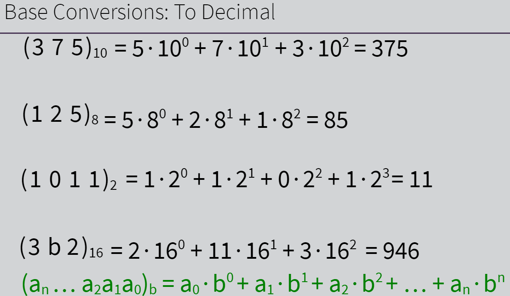
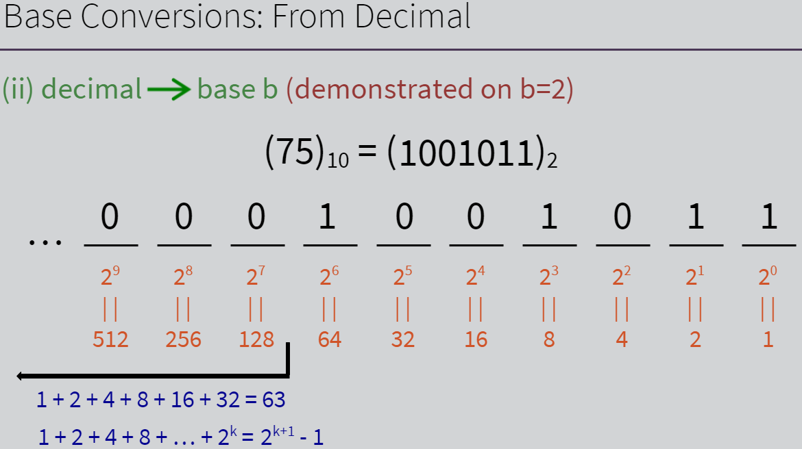
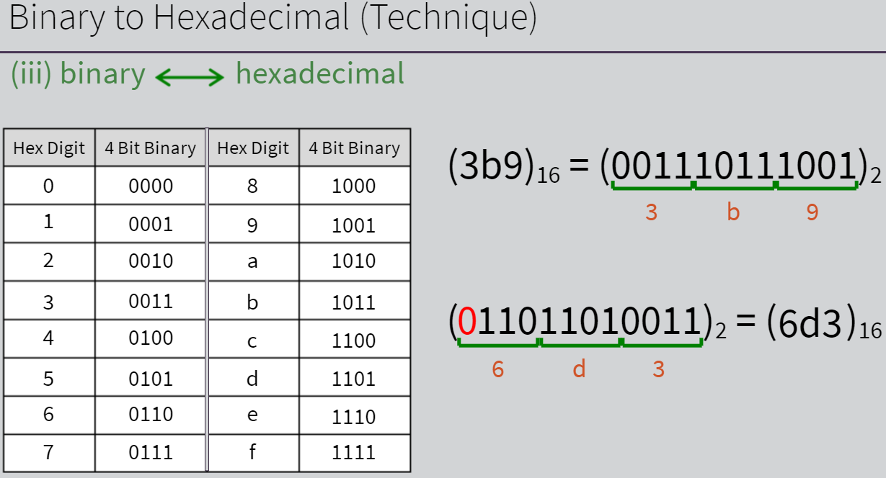
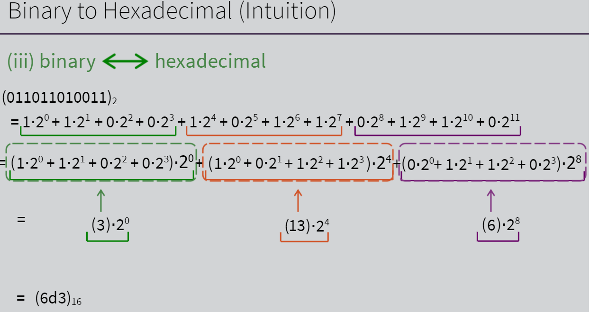

# Week 1: Positional Number Systems

**Digital Data:**

- Numbers: represented in binary
- Text: each character is mapped (tables) to a number (Base64, ASCII, Unicode/UTF-8)
- Images: matrix of pixel colors. Each color is represented as (R,G,B) levels
- Video: sequence of images
- Audio: sampled voltage levels

Each data type has a unique way of encoding. They will then be encoded to numbers and then represented in binary units so that the computer hardware may understand.

Different number systems (digits determine grouping):  

- Decimal (Base10) - digits = 0,1,2,3,4,5,6,7,8,9
- Base 5 - digits = 0,1,2,3,4
- Octal (Base 8) - digits = 0,1,2,3,4,5,6,7
- Binary (Base 2) - digits = 0,1
- Hexadecimal (Base 16) - digits = 0,1,2,3,4,5,6,7,8,9,a,b,c,d,e,f

[binary-number-system](https://www.api.simply.science/math/arithmetic/number-systems/binary-number-system)

Base Conversions _(decimal --> octal --> base 5 --> hexadecimal)_:  
(13)_10_ = (15)_8_ = (23)_5_ = (1101)_2_ = (d)_16_

