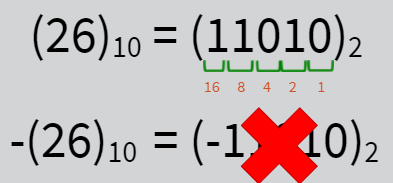
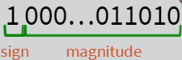
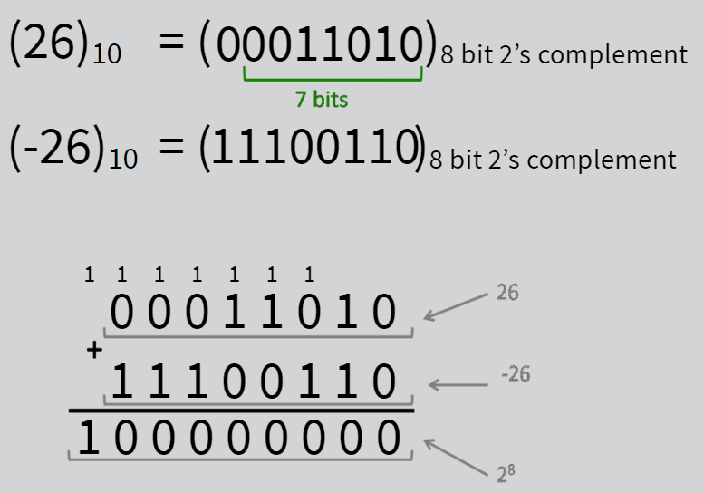
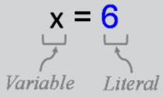
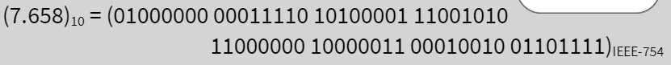
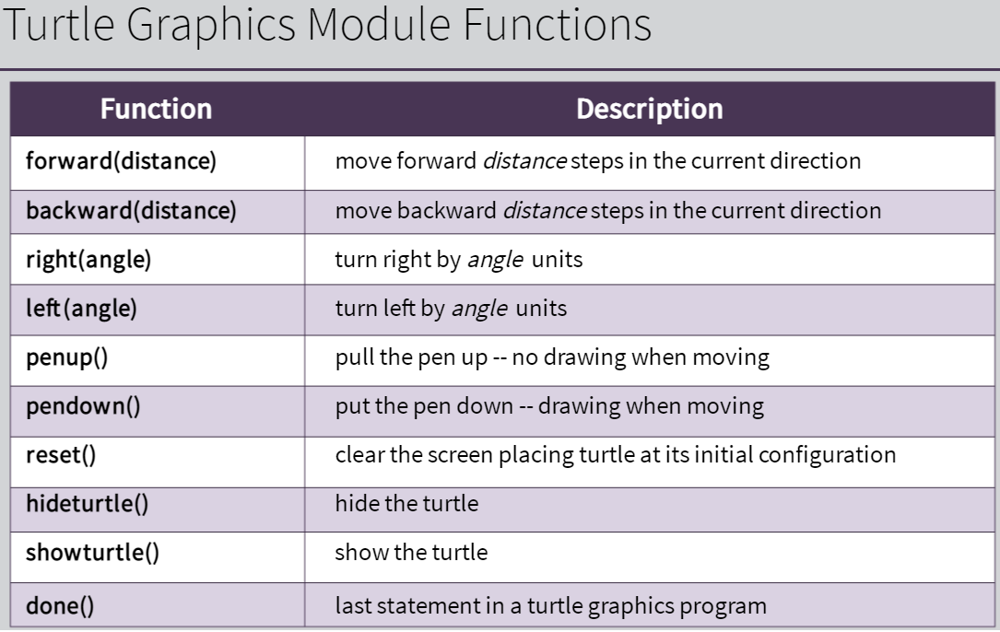

# Week 3: Numerical Data Types and Arithmetic Expressions

[Python Data Types](https://www.w3schools.com/python/python_datatypes.asp) <br>
[Python Casting](https://www.w3schools.com/python/python_casting.asp) <br>
[Python Strings](https://www.w3schools.com/python/python_strings.asp) <br>
[Python Round](https://www.w3schools.com/python/ref_func_round.asp) <br>
[Python Math](https://www.w3schools.com/python/python_math.asp) <br>

---

Three constructs for programming languages:

1. Data (types)
   - Int
   - Float
   - str
2. Expressions
   - Input/Output (I/O) expressions
   - Arithmetic expressions (addition...)
3. Control Flow (Execution of program)
   - Sequential (default flow of execution)

---

**The `int` data type:**

- Kind of data = integer numbers
- Inner representation = the numbers are typically represented using the 2's complement method
- Python Integer Literals (3, 4, -6, 3954, …)
- Arithmetic Operators: +,-,\*,/, \*\* (exponential), // (div), % (mod)

  _Signed numbers:_ <br>
  

  Approaches to represent signed numbers using only 0 and 1 (binary): <br>

  - Sign and magnitude <br> - first bit is sign bit (0 = positive, 1 = negative), remaining bits are magnitude
    

  - Two's complement <br>
    In a k-bit two's complement representation of a number (two properties): <br>

  1.  A positive integer is represented in its (k-1)-bit unsigned binary representation, padded with a 0 to its left
  2.  The sum of a number and its additive inverse = 2<sup>k</sup>

  

  _Integer Literals:_ <br>

  Two forms of data:

  - Variables (x, y ...)
  - (Python) Literals (6, -6, 7.3 (float), "abc" (str),…)
    - These are built-into and defined-in the language
      

  _Arithmetic Operators:_ <br>

  Example:
  `13 ÷ 5 = 2R3` <br>
  Or (Python execution) <br>

  - 13 div 5 = 2 (full-number division)
  - 13 mod 5 = 3 (remainder)
    ```python
    >>> 13 // 5
    2
    >>> 13 % 5
    3
    ```

**The float data type:**

- Kind of data = real numbers (could have fractional/decimal part)
- Inner representation
  - Floating-point method (IEEE-754)
  - Fixed-point representation method (not usually)
- Python literals = `-3.4, 6.0, 0.008975, 8.975e-3` (all float examples)
- Arithmetic operators = `+,-,*,/, **, //, % ` etc.

  _Floating-point (IEEE-754) example:_
  

  _Turtle Graphics Module (Python Library) Functions:_
  
