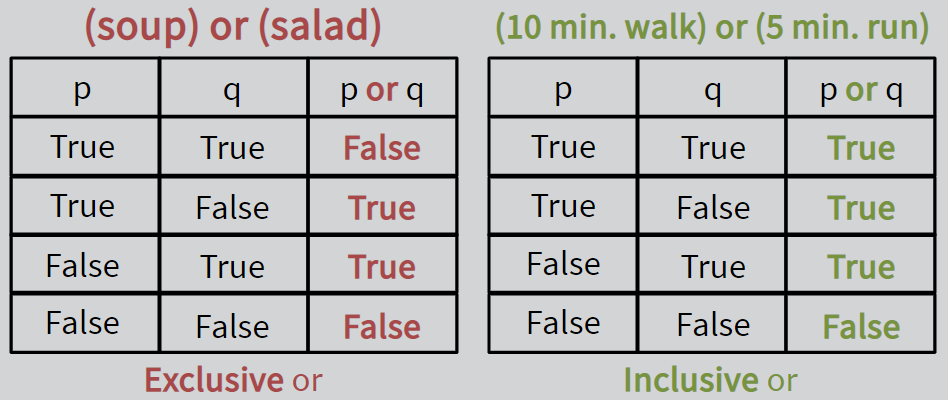
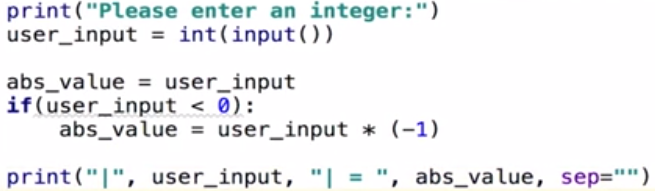
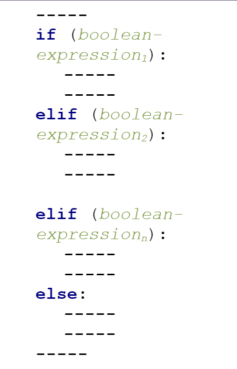

# Week 4: Branching Statements

[Python Operators](https://www.w3schools.com/python/python_operators.asp)  
[Python Conditions](https://www.w3schools.com/python/python_conditions.asp)

---

## Part 1:

Data Types:

- Int
- Float
- Bool

Expressions:

- I/O expressions
- Assignment
- Arithmetic expressions
- Boolean expressions

Control Flow:

- Sequential
- Branching

**The Bool Data Type**

Kind of Data:

- Truth value (true/false)

Inner Representation:

- False is represented by a sequence of 0s
- True is any non-zero value

Python Literals (upper-case first letters):

- True
- False

Boolean Operators:

- Not
- And
- Or --> most programming languages use inclusive `or` operator

**Boolean Expressions**  
Atomic Boolean Expressions:

- The bool literals - `True, False`
- Arithmetic expressions compared with relational operators: `<, >, ≤, ≥, ==, !=`
  - `==` --> check equivalency; is equal to?
  - `!=` --> check equivalency; is not equal to?

Compound Boolean Expressions:

- Simple Boolean expressions combined with Boolean operators (not, and, or)

Syntax and Semantics  
`if` statement --> `if` keyword followed by a space (or parentheses) containing Boolean expression ending with a colon `:` and indented block statements afterwards; these statements are conditioned by the `if`

_Computing Absolute Value_  

---

## Part 2:

Syntax and Semantics  
`If-else` statement (two-way if)

_Determining Parity (even or odd)_  

Two-way if (`if-else`) statement:

- Guarantees that one out of two blocks of code will be executed
- No way for zero or both blocks of code to be executed

Sequential If statements:

- Can lead to zero, one, or two blocks of code being executed (though not in this specific case)

---

## Part 3:

The Letter Grade Problem
Implementation with excess nesting that requires more computation

- Two-way if leads to another two-way if etc.

Syntax and Semantics  
`If-elif-else` statement:  

Solving the Letter Grade Problem:  
Using direct multi-way (`if-elif-else`) implementation

Convert 24-hour to 12-hour time format:

Add the `sep=""` parameter in the print statement to eliminate the (default) spacing in the output
