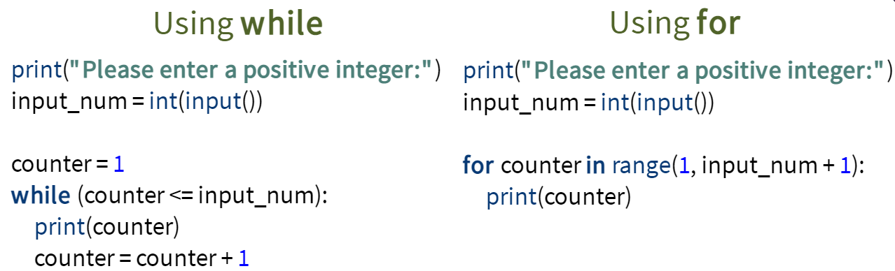
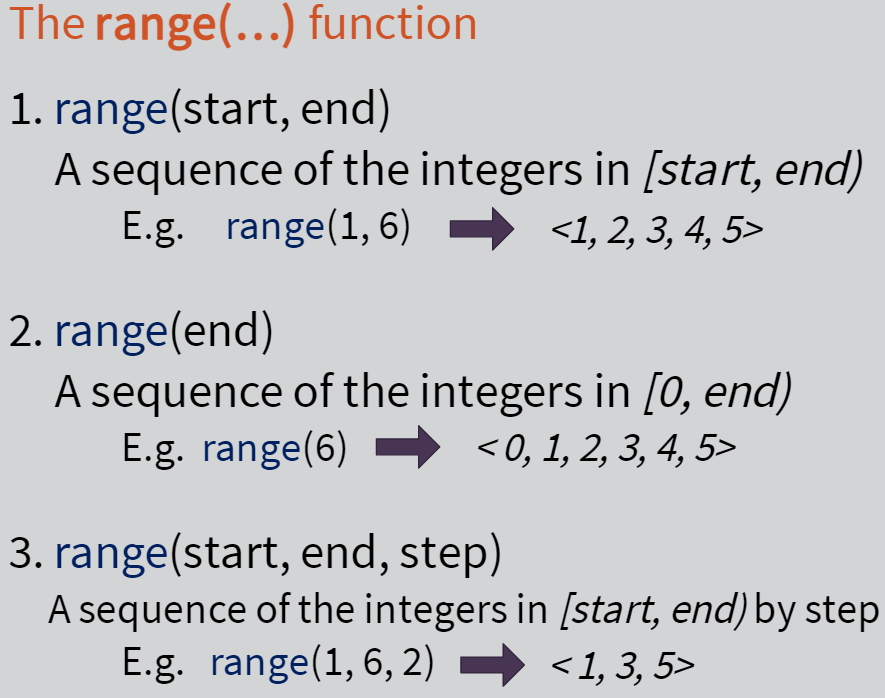
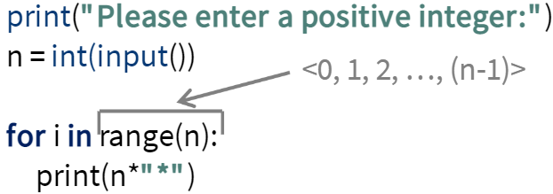

# Week 5: Iterative Statements

[Python for-loops](https://www.w3schools.com/python/python_for_loops.asp)  
[Python while-loops](https://www.w3schools.com/python/python_while_loops.asp)  
[Python range()](https://www.w3schools.com/python/ref_func_range.asp)

---

Iterative = Loop

`While` Statements: Syntax
while (boolean-expression):

- Body
- Body

While boolean-expression is true, the execution of the body continues

- Once it is false, the loop ends

`For` Statements: Syntax  
for `<variable>` in iterable-collection:

- Body

Variable gets value from iterable-collection (ex: `<a1, a2, a3,…,an>`)

- First element, then execute body
- Second element, then execute body
- Etc.

Comparing `While` and `For` statements:

Both can be used interchangeably for similar problem-solving.

`While` statement requires the maintenance of the variable in different sections/positions of the code

- Lower-level statement --> more control

`For` statement focuses the management of the variable in one line of code

- opt for this whenever possible --> easier to read

For statements: Iterable collections and the `range()` function:
Three versions of...

Printing a Square (print lines of `*` n-times in a for loop until n-1):

