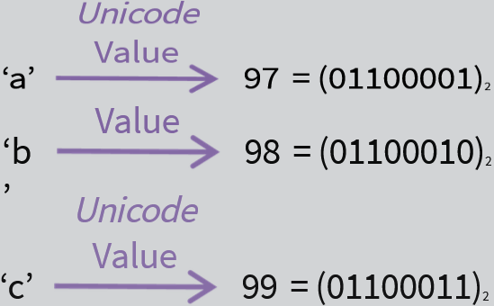
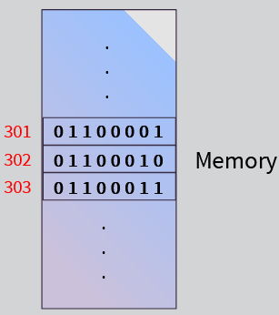
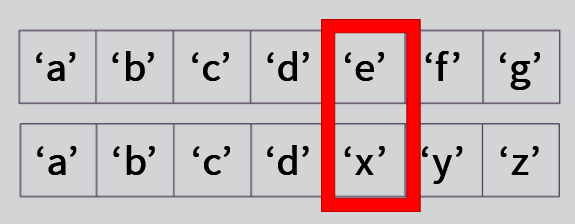
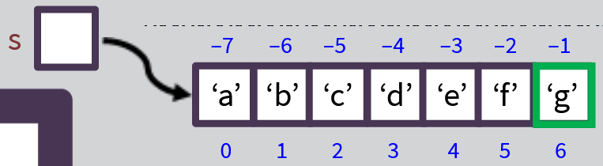
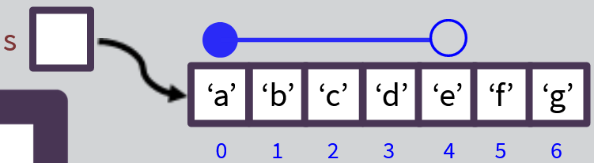
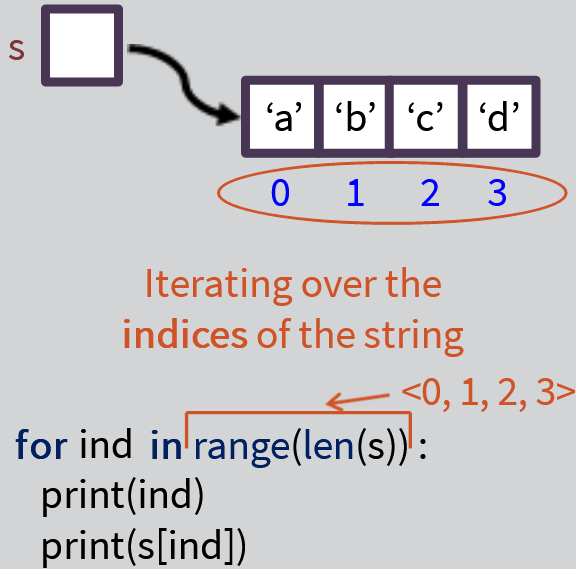
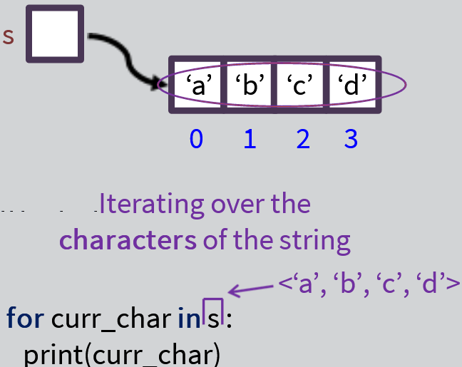
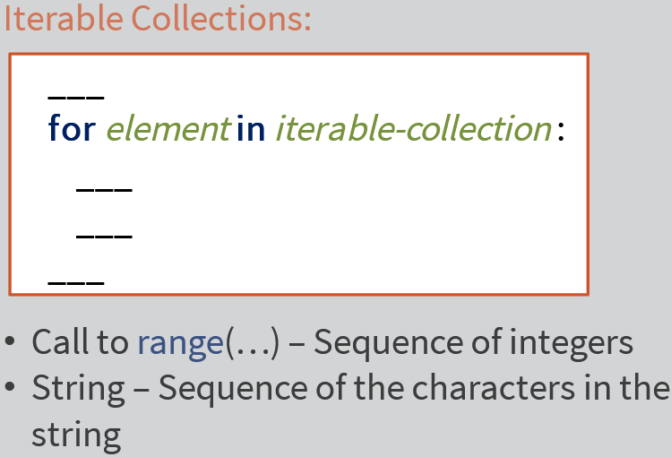

# Week 6: Strings

[Python data types](https://www.w3schools.com/python/python_datatypes.asp)

---

The `str` data type:

```python
"abc" = 'abc'
type("abc")
class 'str'
```

Kind of data:

- sequence of characters (textual data)

Inner representation:

- a sequence of Unicode values





Python `str` literals:

```python
'abc'
"abc"
"yes\tno"
"yes\nno"
"yes\\no"
```

Difference between the value of the string and the printout of a string

String operators:

- `+, *`

Relational operators:

- `==, !=`
- `<,>,<=, >=` (compared in python in alphabetical/lexicographical order)
- Compare ASCII value of first different characters' in the string
  ```python
  "abc" < "de" = True
  ```
  

Functions:

- Len(...)
- Print(...)

Sequential Properties:

- Indexing (zero-based/non-negative indexing system) --> str[i]
- Negative-based indexing system
  

- Slicing --> `str[start : end]`
  ○ `S[0:4]` --> positions 0 to 4 (excluding 4th position)
  - Starting index is included
  - Ending index is excluded



String methods:

- `S1 =  ['a','b','c']`
- `s1.upper() =  ['A','B','C']`
- `s2 = s1.upper() --> ['A','B',C']`
- `s2.isupper(), s2.islower(), s2.isdigit()` --> Boolean methods (True/False)
- `find()` method --> outputs position of first found string
  - When string does not exist, output = -1
  - `find(string, [starting position])`

Iterating over indices:

- For loop
- While loop






