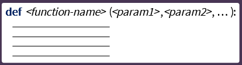
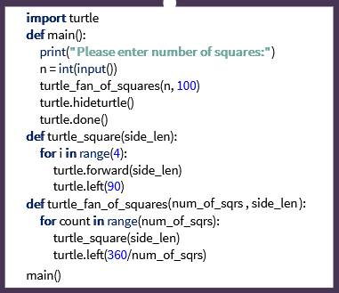

# Week 7: Functions

[Recursive Functions in Python](https://realpython.com/python-thinking-recursively/)

---

Define your own function:

_Function call as a control flow:_

- Program is not executed sequentially
  - turtle_square function is first defined and read by interpreter
  - When turtle_square function is called (execution), the interpreter goes back to the definition

_Functions features:_

- Can be re-used (called/executed) multiple times in code implementation
- Increase readability

Adding `main()` and `turtle_fan_of_squares()` (self-defined) functions:

**Think about user-interaction with program:**

- Use `return` instead of `print()`, in function definition, for calculating functions or inputs from sources other than a user
- See `fahrenheit_to_celsius` program

_Runtime stack:_

- How the python program is run (behind the scenes)
- Interpreter's order of actions

`Palindrome checker` program:  
Definition:

- A sequence is a palindrome if it reads the same backward as forward - Ex: "Was it a car or a cat I saw?"
  Steps:

1. Read string
2. Prepare string for palindrome checking
   - Keep only letters
   - Take all letters to lowercase
3. Check if palindrome
   - Find reversed string
   - Compare original string to reversed string
4. Announce result
