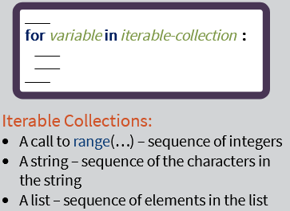
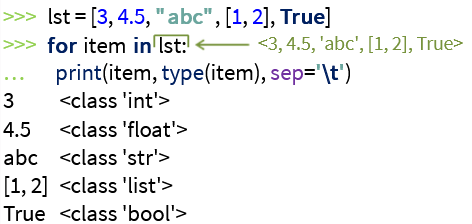

# Week 8: Lists

[Python lists](https://www.w3schools.com/python/python_lists.asp) <br>
[Python lists-access](https://www.w3schools.com/python/python_lists_access.asp) <br>
[Python change elements in list](https://www.w3schools.com/python/python_lists_change.asp) <br>
[Python add list items](https://www.w3schools.com/python/python_lists_add.asp) <br>
[Python loop lists](https://www.w3schools.com/python/python_lists_loop.asp) <br>

---

**List** --> a mutable, iterable, sequential collection (object)

**Properties of Python Lists:** <br>
_can have nested lists_


**Python Literals:** `[1, 2, 3], ["abc", 2.5, [1,2], [],...` <br>
**Operators:** `+, *, - ...` <br>
_Cannot multiply a list by a float, another list or a string_ <br>


**Boolean Operators:** `==, !=, <, >, <=, >=, in, not in`


Interpreter compares the lists lexicographically (similar to strings comparison). <br>
Compares each list component and determines the difference. <br>
Second example (comparing 3 with 5) will mean a "True" result as 3 < 5.


Sequential Properties: <br>
**Indexing:** `lst[i]`


**Slicing:** `lst[start:end]`


---

**Functions:**

```python
len(lst)
min(lst)
max(lst)
sum(lst)
```


Lists as Iterable Collections





**List Methods:**

`Append(value)` --> adds a value to the end of the list <br>


`Insert(index, value)` --> inserts a value at a given index <br>


`Extend(iterable)` --> adds all the elements of an iterable to the end of the list <br>


`pop(index), pop()` --> removes the element at the given index and returns it <br>
'

`Index(value)` --> returns the index of the first occurrence of the value <br>
`Count(value)` --> returns the number of occurrences of the value <br>


`Reverse()` --> reverses the list in place <br>
`Sort()` --> sorts the list in place <br>

**Comparing lists and strings:** <br>


- `Upper` method was not a mutating operation - did not change the change/update the calling object. Unlike the `append` method.
  - Ex: `s` still refers to lower-case string.
  - We could assign a new variable for the upper-case string

List Mutability: <br>


Mutation vs. Construction: <br>


