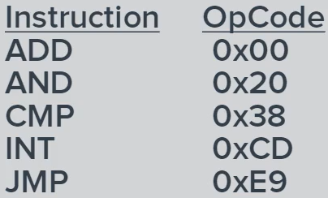

# Week 1: Fundamentals of System Hardware

**Definition of a Computer:**

> An electromechanical device which takes input, does processing and produces output

_Types of Computers:_

- Desktop
- Laptop
- Tablet
- Portable phone (Smartphone)
- smartwatches
- Servers
- Embedded systems (IoT devices)

All will have an input device: keyboard, touch screen, mouse, Wi-Fi card etc.

Servers typically do not have input devices. Sole output device would be the network connection

Inside a Computer (Desktop example):

1. Tertiary storage device (offline storage) - USB - SD card slot (used to be CD/DVD drive) etc.
2. Power supply - convert AC to DC power - 12V and 5V
3. Mainboard/Motherboard (Apple uses "Logicboard" - includes more components)
4. Video card - used for output to a screen
5. CPU (Central Processing Unit) - brain of the system - silicon wafer containing all the logic for computer commands
6. RAM (Random Access Memory) - volatile memory - only active when power is on - primary storage (main memory)
7. Hard drives/SSDs - secondary storage or long-term storage (non-volatile/persistent) - when computer shuts off, HDD/SSD retains memory

**All computers have:**

- CPU
- Main memory (RAM) where code and data is stored temporarily
- Secondary storage when information is stored permanently

_Most computers will have:_

- A video graphics controller where images can be rendered for display on a screen
  - Modern controllers contain GPU (Graphics Processing Unit) - Very good at arithmetic operations vs. CPUs
- Network interface for communications: Ethernet (copper, fibre), Wireless, etc.
- Peripheral interfaces: USB, Thunderbolt, Firewire, SCSI, etc.

Communications between the devices in a computer:

- Internal communications are done via a "bus"
- Physical pathway between CPU and main memory, but also carries data to and from Input and Output (I/O) devices
  - Examples: USB (Universal Serial Bus) for I/O, System Bus for CPU and storage unit (main memory)

**The CPU:**

- Single piece of silicon in the form of a chip
- contains transistors that act as gates to allowing/denying an electrical conduit to pass electrons
- The only location where code is actually executed
- Only runs "machine language" code
- Operates on a "fetch-decode-execute" cycle
  - Fetch instruction from main memory
  - Decode the instruction
  - Execute the instruction
- Each CPU has its own instruction set
- Has a small amount of memory called "registers" which are used to perform operations and store results
- May have a "cache" memory to perform operations more quickly

  _Machine Language:_  
  Computers can only understand very basic commands like:

  - Move
  - Add
  - Subtract
  - Multiply
  - Compare
  - Jump (basis for a "for" loop or "if" statement)
  - Etc.
  - The CPU designer puts the capability to perform these operations in the physical chip

  _Instruction Set:_  

  - CPU designers create an instruction set that the CPU can perform
  - Instruction set, usually as small as 100, can be represented by a numeric value
  - When CPU receives an instruction, it performs that task
  - The instruction set is vital to understand processing of code (whether with interpreter or compiler)

  

  _Fetch-Execute Cycle:_  

  - CPU performs a fetch to move the instruction from main memory into the CPU (specifically to an instruction register)
  - CPU then decodes the instruction, also moving any additional data that might be necessary with that instruction
  - Executes that instruction
  - Process repeats with next instruction in the sequence
  - This process can take as little as 10 nanoseconds --> millions of instructions per second!

**Memory:**

- Instructions and data all come from memory (RAM)
- In order for code to be executed, it has to be in a register built into the CPU
- Why not store everything in CPU registers?
  - CPU registers are much more expensive
- As memory gets faster, it tends to get more expensive; so we have a hierarchy.

  _Memory Hierarchy (as memory size increases, speed decreases - descending the hierarchy):_

  1. Register - approx. 576 B - could store 1-2 instructions
  2. Cache (L1) - approx. 64 KB
  3. Cache (L2) - approx. 20 MB
     - _can have multiple levels of cache_
  4. DDR/Main Memory - approx. 384 GB - could store entire program
  5. Secondary storage - will contain an entire operating system

     

  _RAM (Random Access Memory):_

  - Name given because any place in it can be accessed in the same amount of time
  - not true for older secondary storage
  - RAM is broken into bytes
  - each can be accessed independently of others. Each byte is individually addressable
  - RAM requires power to maintain memory
  - volatile memory. When power is turned off, RAM memory is lost
  - Sleep state: electricity is kept flowing to store RAM. Startup time is quick
  - RAM is already active.
  - Hibernate state: all RAM contents are stored in the secondary storage. Complete system shutdown. Startup time is slower (copy storage contents to main memory)

**Secondary storage:**

- HDD (Hard Disk Drive)
  - Known as "spinning" drives
  - Contain magnetic material discs that rotate together at a constant velocity
  - Contain read/write heads which move to different radii on the disk
  - Allow the system to access any position via it's three dimensional polar coordinates
  - Accessing first the innermost radius then the outermost radius takes significantly longer than two adjacent radii
  - Can store a lot of data - where speeds are not critical, it is a good solution
- SSD (Solid State Disks)
  - Contain a number of chips like USB flash drives
  - Data is stored electrically in these chips
  - All data can be accessed in the same amount of time (similar to RAM)
  - Draws less power - produce less heat than HDDs
  - Due to cost, these drives are smaller than HDDs but perform much faster
