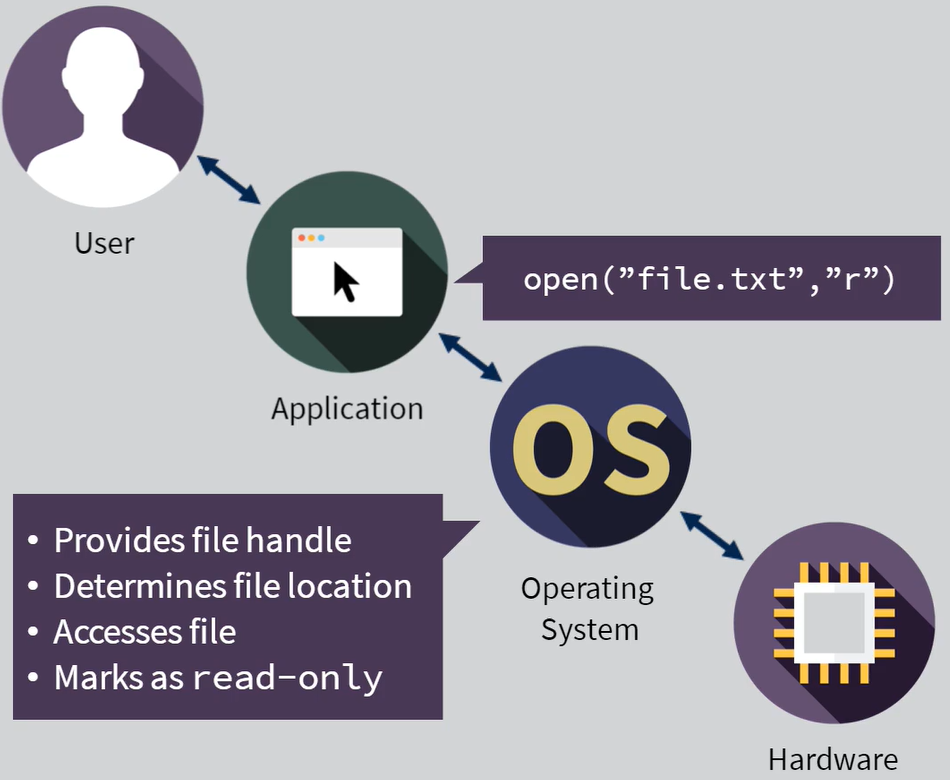
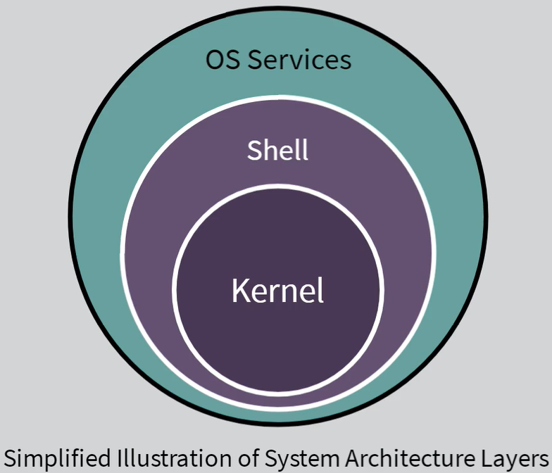
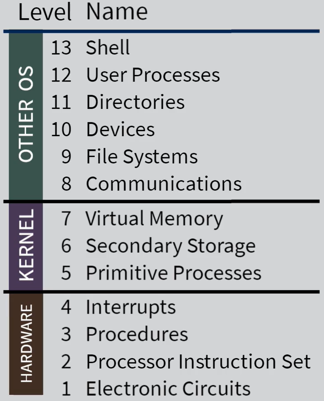
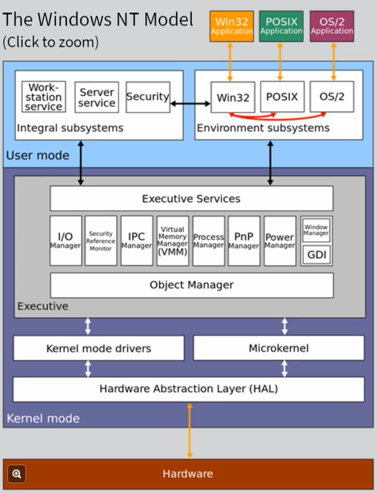

# Week 2: Operating Systems

**What is an OS?**

- A program that controls execution of application programs and acts as an interface between applications and computer hardware
- Software which manages "the system"
- Runs on the same processor as the user's program code
- Does not include applications. OS is a separate entity

Layers of Interaction:

- User <--> Application <--> Operating System <--> Hardware
- User will not interact with OS directly. Users will use applications. Applications interact with the OS:

_OS is tailored to the hardware (ex: Intel architecture), application is tailored to the OS; applications can be written more generically._

**The Kernel:**

- Core component of the OS
- Responsible for managing system resources
- Assists application with performing work
  

---

What you buy in the store:

- The OS is only a small portion of what you buy!
- Extra stuff includes: web browsers, text editors, device drivers, other applications
- Fundamentally, the kernel is the operating system
  - Key features includes: memory management, process scheduling

OS as a resource manager:

- System resources (memory, CPU etc.) are finite
- OS needs to allocate system resources to itself

The Government example:

- Government gets resources, tax money
- Government spends tax money on services
  - Fire fighters
  - Police
  - Roads
- Government needs buildings to operate and people to run it, so it take some of the resources (money) to pay for its operating costs
  - Money spent on running the government is considered necessary waste to the people (users of the government)

Back then...

- Mainframes dominated the computing industry
- Computer ran only one program at a time
- The one program had complete access to all the system resources
- OS was only responsible for getting programs ready to run
- Requires JCL: job control language
- Mainframe operator (human) decided which order to run programs
- When one program finished, the OS was ready with the next
- Called batch multiprogramming

Today's Environment:

- Lots of processing power and lots of resources
  - Run multiple programs simultaneously
  - Multitasking
- OS manages allocation of resources (ex: Office applications)
- OS decides which programs can run and when
- OS will stop and restart running programs: pre-emption
- Called time sharing

---

Monitoring running programs:

- OS keeps track of all running programs in the system in order to manage:
  - Resource allocation
  - Scheduling
  - Authorization
- Many programs can be loaded simultaneously
- Same program could be loaded multiple times
- Keeping track of multiple instances of the same program using a "process"

A Process is:

- A program in a running state
- Loaded into main memory
- Scheduled

A Process has:

- Access to files
- Access to networking connections

OS Levels:

- Shell = Explorer (Windows) or Finder (MAC)

---

**The Windows Model**

- Microsoft created the HAL (see below) to not be tied any one architecture
  - This layer can be edited/replaced to accommodate other architectures
- For applications to access system hardware, they must go through the kernel
  - It acts as the proxy
  - Takes more time, but makes system more stable - avoid blue screens of death (BSOD)

The HAL (Hardware Abstraction Layer):

- Designed to be replaced dependant on the system hardware involved, instead of re-writing the entire OS
- Layer which can provide the kernel with a set of functions to call which program the hardware properly

Windows Device Drivers:

- Video controllers, usb controllers, usb devices, other accessories
- Device drivers are kernel-layer software written by companies that design hardware
- They provide functions for the kernel to call in order to access the hardware
- Poor device driver software running inside the kernel (access to all system resources), was the cause of frequent "blue screening" before Windows Hardware Quality Labs (WHQL)

---

**UNIX:**

- Category of OS
- A multi-user, multi-tasking OS
- Designed to allow users to manage their own tasks
- Built by AT&T @ Bell Labs
- Released into public domain as open source software
- Comes in many different flavours: AIX, Linux, Solaris
