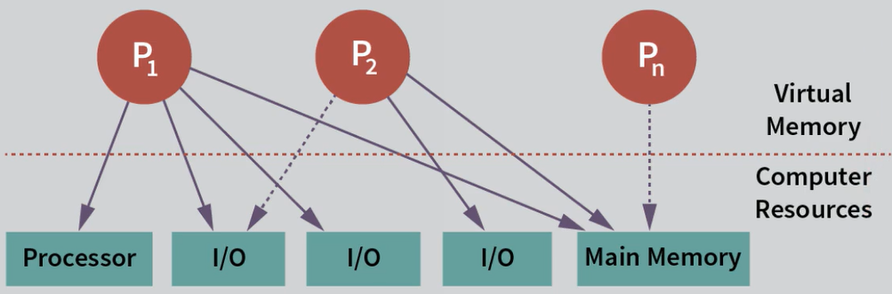
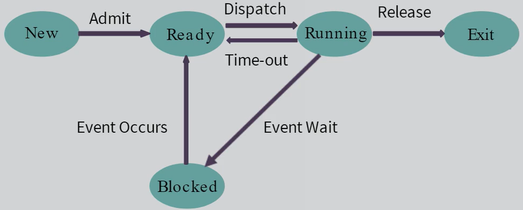
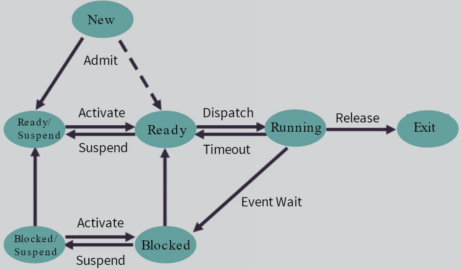
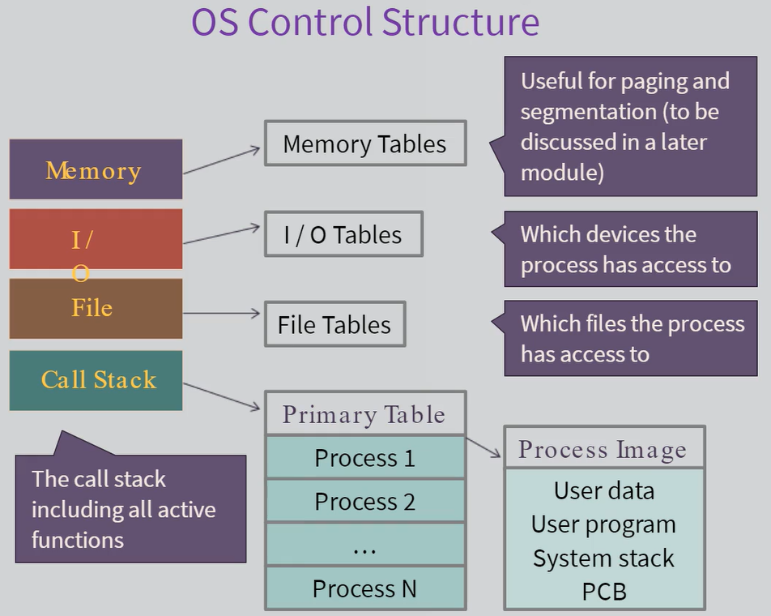
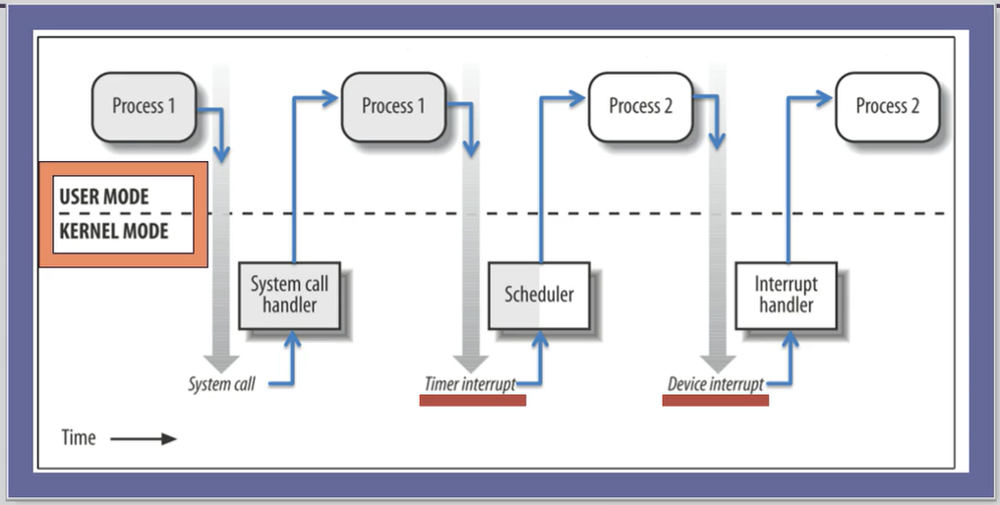
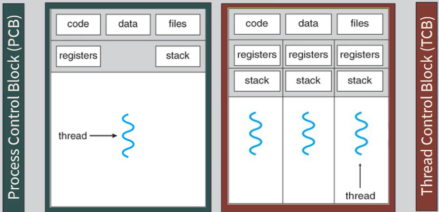
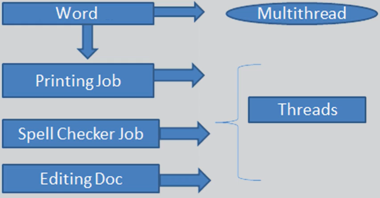
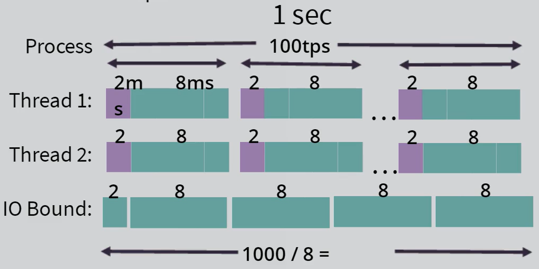
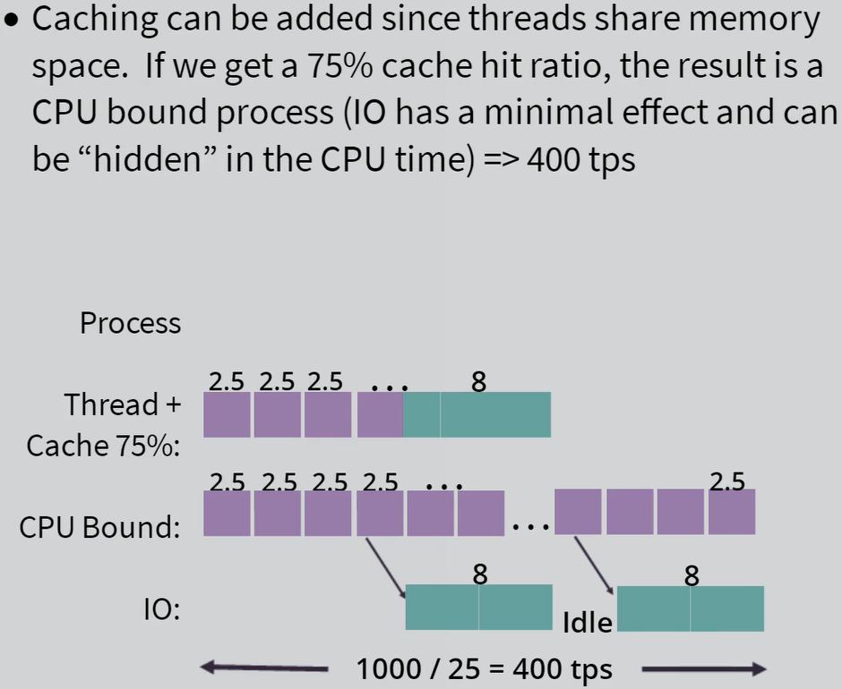
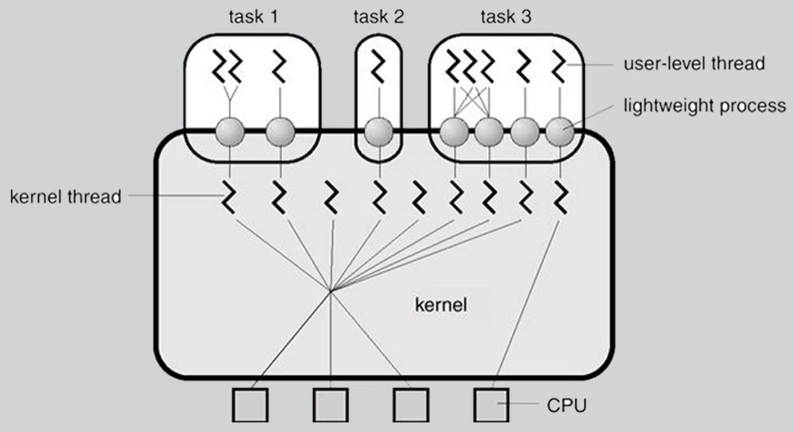

# Week 3: Processes and Threads

What is a Process?

- A running program in a system state (ex: web-browser tab, Notepad etc.)
  - Includes code, data, context
  - Stored in sequential memory space (process image)
- Process is created by OS to keep track of
  - State of the running program
  - Resources assigned to the running program
  - Any connections the program might have to other processes/computers

State Definition

- A condition that the process will spend a significant amount of time in

Five-State Model for Processes

`New`: create an I/O operation - read information from secondary storage into main memory (RAM)  
`Ready`: processes waiting for CPU use
`Running`: Processes actually on the CPU

>     Either `timeout (pre-emption)` - cannot run forever  
>
> OR   > `Blocked` - ex: file not readily available. Instead of occupying CPU, the CPU may run other processes.

`Exit`: Linux calls it "Zombie State". Processes done running - no more code to run

- Code is gone
- Context is gone
- Message needs to be given to parent process whether child process was successful

Processes will move between these 5 states in a non-linear way, so OS can keep track of processes

Suspension

- Some processes do not need to be executed immediately
- The process is completely removed from main memory
- Process is stored on secondary storage for future return to the point we left off
- Frees main memory for other processes
- Controlled by medium-term scheduling algorithm
- The process with NOT be aware of the suspension
- Some reasons for suspension
  - Debugging
  - Long-term delay
  - Freeing main memory

Seven-State Model for Processes

Want to use the extra states (Ready/Suspend & Blocked/Suspend) as an emergency measure to free up memory

- Process is removed from main memory and returned when there is more time/resources

Process Image - The PCB

- Process Control Block - critical to the OS
- Includes all the information the OS needs to run and control the process (ex: memory tables)

---

**Contents of a PCB:**

- Process Identifiers (PID): a unique numeric value for this process (16-bits: 65536 maximum)
  - Keep track of a single process; what process is doing and what it can do
  - PIDs get recycled - when a process ends the PID becomes available for reuse by another process
- Parent Process ID (PPID)
  - Usually the initialization processes (ex: system bootup)
  - Hierarchy of processes for permissions and ability to start/stop process
- User Identifiers (User ID)
  - Processes started by user are restricted by user-access level
- Registers
  - CPU registers stored in PCB
  - Saving the state of the CPU when the process stopped running
- Stack pointers
- Scheduling
  - Prioritization of processes
- Linkages
- Inter Process Communication (IPC)
  - Facility inside OS that allows two processes to send messages
- Resources
- Memory

---

**Modes for OS:**  
Inside CPU, there is one register, known as the PSW (Program Status Word) register

- A single bit that tells system whether it is in `User` or `Kernel` Mode  

_User Mode:_

- Cannot directly access system hardware
- Cannot run some CPU instructions
- Cannot access any memory outside of its own

_Kernel Mode:_

- Code can execute any part of the system

OS will always run in kernel-mode. Will switch to user-mode when user initiates process that belongs in user-mode

- OS can act as a postman, so OS can take a message from one process and move it to another (IPC facility)

Switching

- Easy to go from Kernel to User
- User to Kernel happens automatically upon certain events

When to process switch
When does a switch occur

- Interrupt - a hardware signal indicating that the hardware needs servicing
- Trap - a condition which requires OS support
- Blocking System Call - a request from the process for OS support
  Process/Context Switch - process moving between states (ex: ready to running)

Steps to Process Switch

- Save the context into the PCB
- Update accounting (ex: how long it has been running, how much CPU time used, how many connections made etc.)
- Move the PCB to the appropriate queue
- Choose another process
- Update memory management
- Restore its context

Multiple Processors

- Multiprocessing means these problems become more complex and happen more often
  - Symmetric multiprocessing - two processes running at the same time
- Solve the processes problems and not simply adding more hardware

---

**Threads**

- Unit of execution within a process - smallest sequence of programming instructions that can be managed by a scheduler (OS)
  - Resource ownership now becomes the only concern of the process
  - Execution - scheduling and running PARTS, yes there will be many, of the process become threads
    - How to execute the process code
- Process is actually owning things (resources) and doing things (execution)

What is Where in the Multithreaded Environment

- Process - Process Control Block - unit of resource ownership
  - Memory allocation
  - Files
  - Linkages
- Thread - Thread Control Block - unit of execution
  - Context (processor registers)
  - Stack (including local variables)
  - Access to all of the resources of the thread

_Reasons for Multithreading_

- Foreground/background threads executing processes working on the same resource (ex: MS Word document)
- Asynchronous processing
- Infrequent tasks (ex: data backups at scheduled time)
- Speed reading
- Synchronous processing
- Modular program structure (ex: MS Word - grammar check, spell check)
  - Separate programs, but components of a larger one

_Performance Example_  
File Server:

- File server does I/O for 80% of the task - get file, bring it in and serve it to the customer
- Each transaction requires 2msec of CPU time and 8 msec of I/O time
  - No threads, all asynchonous = 10 msec/transaction = 100tps
  - Threads, CPU synchronous with another I/O request = 125tps

Preventing I/O operation if cache is utilized

Threads: segregating the responsibility and integrating the response to cache as much as possible

Thread States/Operation

- Ready, running and blocked
  - Threads don't need New or Exit
  - Suspension is a process level concept

What are the Downsides

- Concurrency!
  - Problems with shared memory
- Thread over-utilization - leads to confusion

Implementation of Threads

- Kernel-level threads
  - Different from Kernel Threads (where the OS is threaded)
- User Level Threads
  - Downsides of ULTs
- Hybrid approach (created by Solaris)
  - Light weight process
- Thread scheduling details

