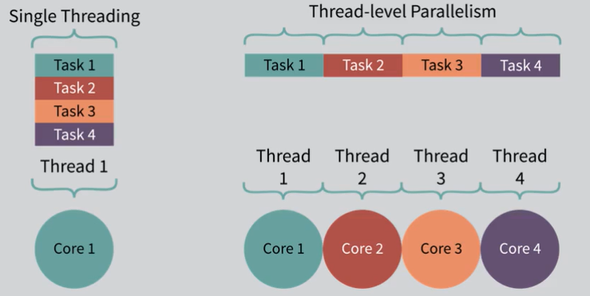

# Week 4: Thread Concurrency and Deadlocks

_Reminder about threads:_

`Process` --> a unit of resource ownership  
`Thread` --> a unit of execution

- All threads share the same resources of the process, without any control
- Threads run as if they were a separate program
- Threads can run asynchronously
- Example: `Microsoft Word`
  - Thread for keyboard inputs to store in main memory
  - Thread for taking main memory data and printing on screen
  - Thread for reading/inspecting for grammatical mistakes
  - Thread for reading/inspecting for spelling errors
  - Thread waiting every 10 minutes to save document
  - All threads running asynchronously in the background
    - Decided by OS (scheduler); which thread to run, for how long and when.

_Features of having multiple threads:_

- Ease of communication
  - Being embedded within a process, threads can communicate with one another
- Effective solution to prevent blocking while reading data
  - Preventing one thread from being blocked while another is working
- Threads are relatively easy to create
  - Create TCP (thread control block)
    - Code is already loaded
    - Memory is already allocated
- Risk of asynchrony

---

**Asynchrony**

- Asynchrony occurs when two threads are running seemingly at the same time
- Example; - A running thread might be interrupted due to hardware considerations, and a different thread chosen to run - A running thread runs out of time on the CPU and a different thread is chosen to run - Two threads running on two different CPUs simultaneously
  Critical Sections:
- Code will be written with the expectation that once we start a particular piece of code, it will run through to completion with being interrupted
  - Cannot be guaranteed
- If code is interrupted, asynchrony can occur
- Worst-case scenario, data could become corrupt
- The programmer must identify a "Critical Section" of code which, once entered, must prohibit any other thread form entering a critical section on the same resource
- Critical sections should be as small as possible

Critical Section - Supplier/Demander Problem

- Similar to luggage carousel airport waiting area
  - If no space left, luggage will no be loaded (stop the input)
  - If people are there waiting, they are waiting for their luggage
    - If no luggage there, nobody will take any luggage
  - Supplier/demander situation

_Supplier/Demander Explanation_

- Multiple supplier and multiple demander threads are all "active" in the system, however this is a uniprocessor system so only one can run at a time
- The bufferCount should never exceed 500 as there are only 500 places to store items in the buffer
- Due to the asynchrony, the bufferCount can easily go higher than 500
- Once > 1 thread is introduced, we have the potential to exceed the size of the maximum limit of the buffer

_Double Update/Missing Update_

- Two transactions are happening on different processors at the exact same moment in time
  - The balance starts at $100
  - The first transaction is a deposit of $50
  - The second transaction is a withdrawal of $100
  - Lost deposit because we copied an amount, then copied back an incorrect result
    - Did not recognize possibility for asynchrony
    - Threads working on a shared resource; they will have to coordinate their activities

---

_Critical Sections Identified_

- In the supplier/demander example, the checking and changing of the buffer and bufferCount must be "atomic".
  - Need to run portions of code, such that if they are interrupted, we make sure that we don't ever use those common resources in another thread until the first thread completed its task and update the resource completely.
- Supplier/demander problem - Check the buffer and then change the buffer; not atomic unless we consider critical sections
- Atomic activity - checking and then changing!
- Double update/missing update problem, the entire function should be atomic
- The need for these sections of code to be run atomically, indicates that they are critical sections

_Mutual Exclusion Rules_

- No two threads may be in a critical section at the same time
- When no thread is in a critical section any threads that request entry must be allowed without delay
  - OS serves as gatekeeper for critical section entry
- A thread may remain inside a critical section only for a small amount of time

Fundamental Mutual Exclusion

- The system bus provides a fundamental system for providing mutual exclusion
- Memory cannot be accessed by two processors at the same time, one will win access to the system bus and the other will have to wait until next cycle

Software Solutions for Mutual Exclusion  
Peterson's algorithm

- First software solution to provide mutual exclusion
  - Make sure we don't have a critical section within the code

---

**Hardware Solutions - more for OS to do work**

- Disable interrupts
  - Prevent the CPU from being interrupted and you prevent asynchrony
  - Is this a good idea?
    - Interrupts occur all the time; if we disable interrupts and have a problem with our code and never re-enable interrupts, the only way to solve is to push the power button - it will never come back on again because we don't have an interrupt that allows the system to run
- Test and Set
  - Provide a single ML instruction to check a memory location (Boolean flag) and set it if it is not set. A result is returned to indicate success or failure
- Exchange
  - The location in memory (maybe a flag) is swapped with a register

---

**Semaphores - flags**

- Semaphores are a common solution programmers use to protect critical sections
- The OS provides some of the service, but most of the work is done in user space
- A semaphore is a structure with fundamental communications data
  - Primarily two functions are used: signal and wait
    - Enter into critical section = wait
    - Exit out of critical section = signal
  - Signals can be queued, or, if a thread is waiting, a signal will cause it to be released
  - Wait causes the thread to block if there are no signals to be consumed, the thread is queued to await the next signal
- The semaphore relies on a signal being queued initially
- Before entering a critical section, the thread calls "wait". When exiting, the thread calls "signal"
  - Signal are consumed - they don't exist continuously
    - A signal that's send, will be consumed by a wait that's called
- Thus a semaphore will always have a signal queued when no thread is in a critical section

_Semaphore Internals_

- Internally, semaphores usually keep some counter of the number of signals which have been sent
- Wait causes the counter to decrement
- If the counter ever becomes negative, the thread which caused it to be negative, and all subsequent threads, will be blocked and placed on a queue. This is where the OS is invoked to perform the block.
- When a signal is sent, the counter is incremented and if the counter is not positive, the next thread on the queue is released.
- Since the act of checking and modifying the counter is a critical section, the semaphore usually uses a hardware solution to prevent asynchrony in itself

_Deadlocks_

- If a set of threads are all waiting for each other, then there is no way that any one of them will complete
- Usually this results from one thread waiting for another thread to release a resource
- This is a permanent block which cannot resolve itself over time
- There is no sufficient solution today

_Deadlock Resource Types_

- Reusable
  ○ One the use of the resource is complete, the resource can be used again by another thread
  ○ Examples include memory, devices, data structures, semaphores etc.
- Consumable
  ○ Once used, the resource is gone
  ○ Examples include interrupts, signals, messages and data in IO buffers

_Items required for a Deadlock_

- Mutual exclusion
  - Only one thread can use a resource at any given time
- Hold-and-wait
  - While a thread is "waiting" on the allocation of a new resource, it retains all existing locks
- No pre-emption
  - A resource cannot be removed from a thread forcefully
- Circular wait
  - A closed chain of threads in which the last thread is waiting on the first (dependencies)

_Solutions for Deadlocks_

1. Deadlock Prevention; eliminating on the four items (above)

   - Mutual exclusion
     § This is not often possible as mutual exclusion is usually required
   - Hold and wait
     § The system can require that all locks be requests simultaneously
     § If a thread hold a lock, it cannot obtain another lock
   - No pre-emption
     § If a thread requests a new lock, and the request is denied, the thread must release all existing locks individually
     § The OS may have authority to remove existing locks individually
   - Circular wait
     § The resources are ordered such that a thread holds a lock on a higher numbered resource, it cannot request a lower numbered resource

2. Deadlock Avoidance
   - Required that the OS know, ahead of time, which resources a thread will request before it is finished
   - Every time a thread make a new request, the OS runs an algorithm to see if that request will cause the system to deadlock
     - If it will, the request is denied or queued
   - This usually uses a "Banker's algorithm"
     - a bank has enough "resource" in order to pay our all the deposits - it cannot loan more money than it has in deposits (resources).
3. Deadlock Detection
   - This is not at all restrictive
   - Recognize that deadlocks will occur and that a detection algorithm will need to be periodically run
   - Once a deadlock is detected, the OS should take action to resolve the deadlock
   - Solutions to existing deadlocks
     - Rollback to a previously unlocked state (requires transaction logs)
     - Abort all deadlocked threads
     - Abort a thread, check for deadlock, repeat
     - Pre-empt resources until the deadlock is resolved

**Dining Philosopher's Problem - Deadlock Prevention**

