# Week 1: Computer Networking

What is the Internet?

- A network of networks
- Different protocols & standards

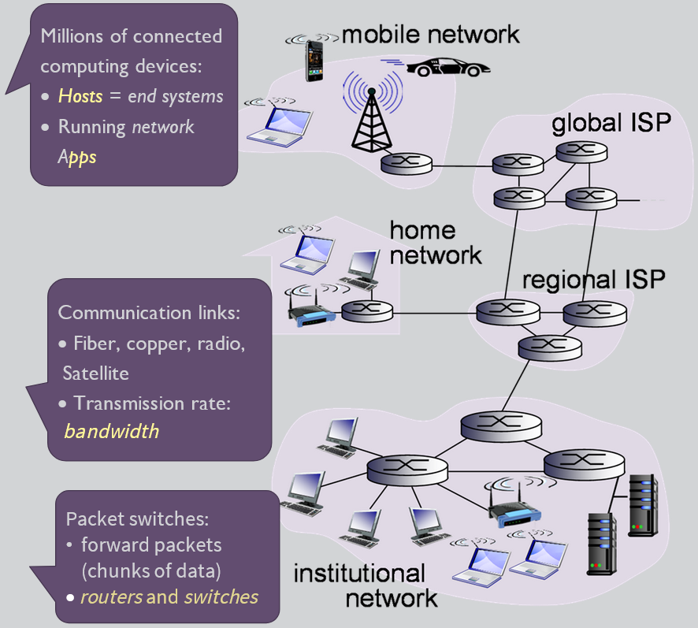

A service view:

- Infrastructure that provides services to applications:
  - Web, VoIP, email, games, e-commerce, social networks
- Provides programming interface to apps
  - Hooks that allow sending and receiving app/programs to "connect" to internet
  - Provides service options, analogous to postal service

What is a (network) protocol?

- Specific actions taken when certain events occur (send/receive messages)
- All communication activity on Internet is governed by protocols
- Protocols define:
  - Format
  - Order of messages send and received among network entities
  - Actions taken on message transmission, receipt

_Network Structure:_

- Network edge:
  - Hosts: clients and servers
  - Servers, often in data centers
- Access networks, physical media:
  - Wired, wireless communication links
- Network core:
  - Interconnected routers
  - Network of networks

Access networks and physical media

- How to connect end systems to edge router?
  - Residential access nets
  - Institutional access nets (school, company)
  - Mobile access nets
- Keep in mind:
  - Bandwidth (bits/second) of access network?
  - Shared or dedicated?

Examples:

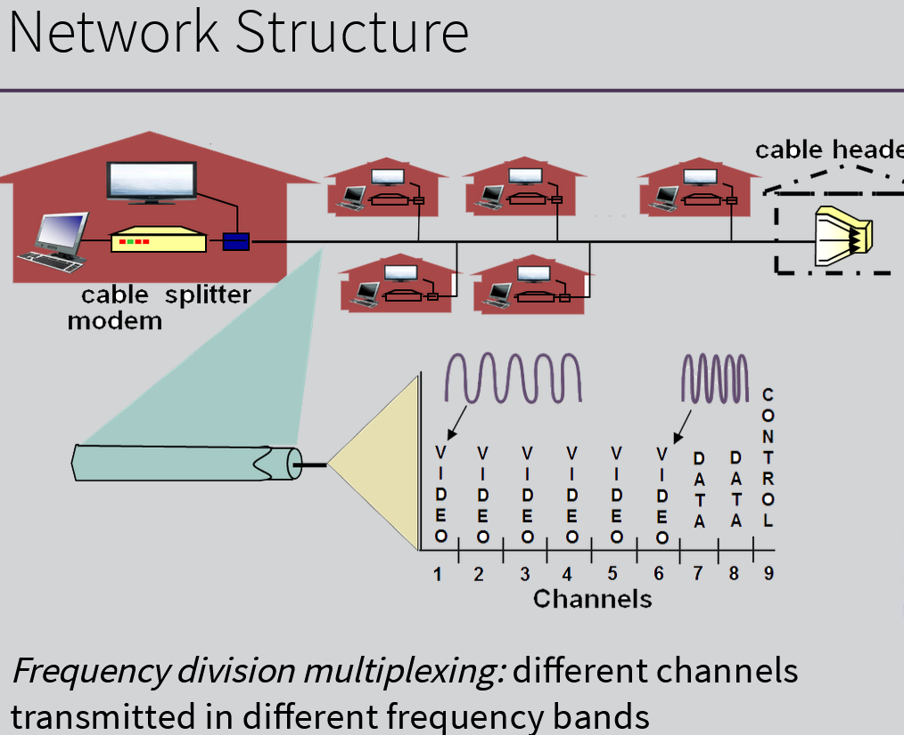

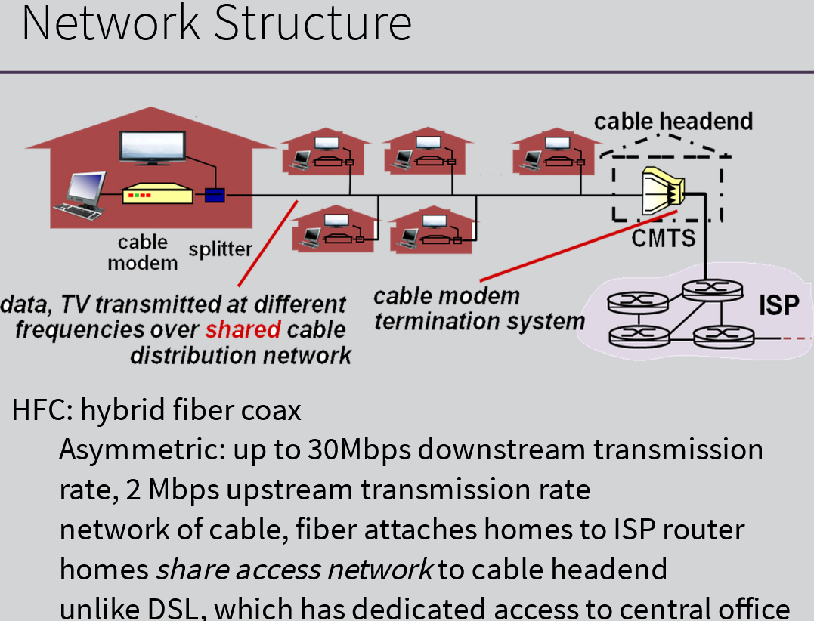

**Access Net: Home Network**

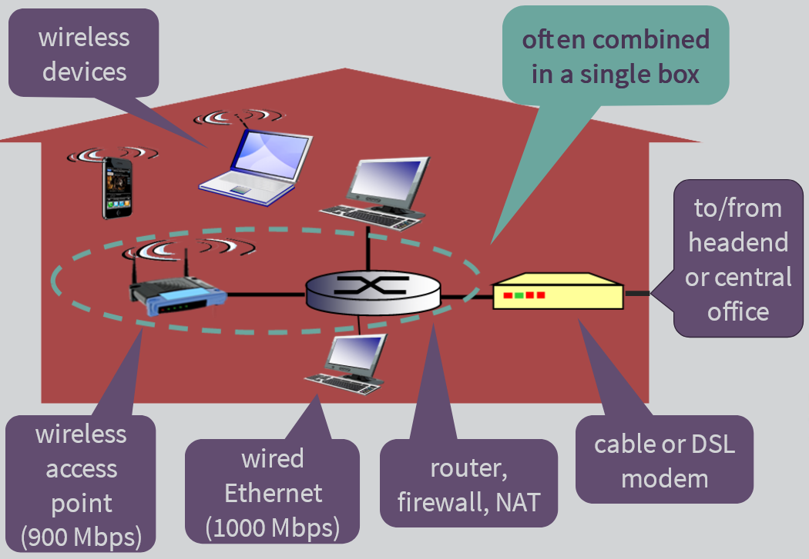

**Enterprise Access Networks (Ethernet)**

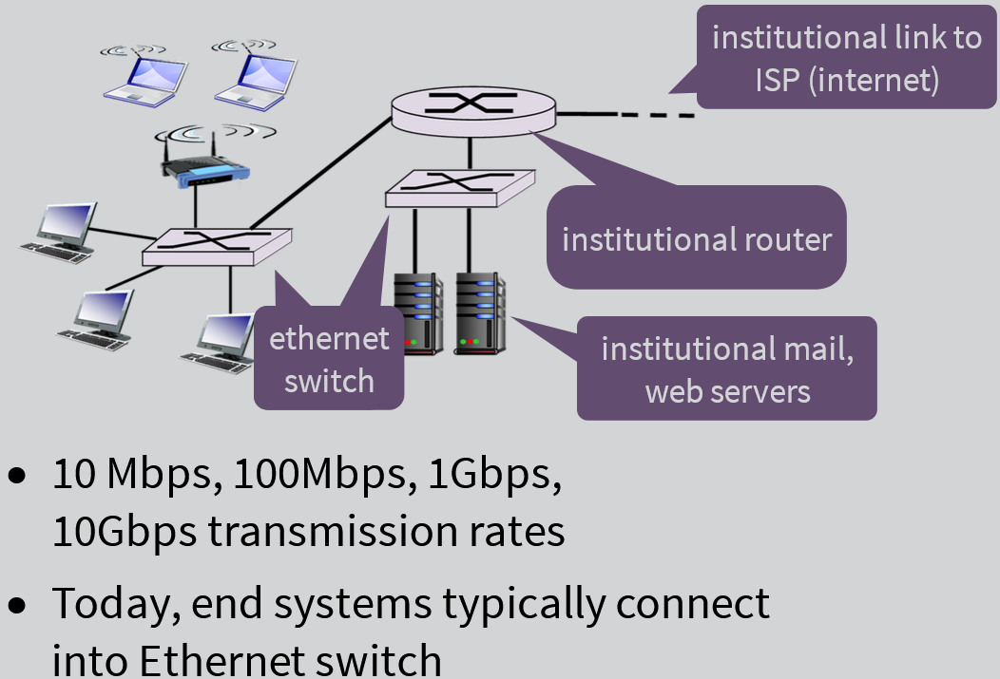

**Wireless Access Networks**

- Shared wireless access network connects end system to router
  - Via base station a.k.a "access point"
- Examples:

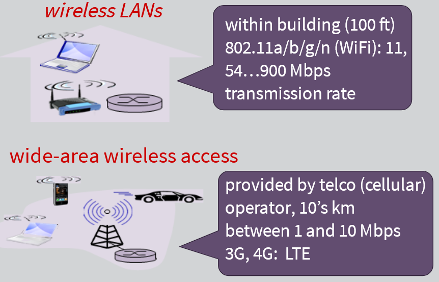

---

Physical Media

- Guided media
  - Signals propagate in solid media: copper, fiber, coax
- Unguided media
  - Signals propagate freely: radio
- Physical link (cable or radio)
  - What lies between transmitter & receiver
- Bit
  - Propagates between transmitter/receiver pairs
- Twisted pair (TP)
  - Two insulated copper wires
    - Category 5: 100Mbps, 1Gbps ethernet
    - Category 6: 10Gbps
- Coaxial cable
  - Two concentric copper conductors
  - Bidirectional
  - Broadband
    - Multiple channels on cable
    - HFC (Hybrid Fiber Coax)

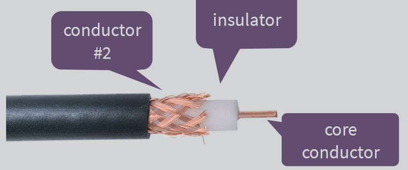

- Fiber optic cable
  - Glass fiber carrying light pulses, each pulse = a bit
  - High-speed operation
    - High-speed point-to-point transmission (e.g., 10's-100's Gbps transmission rate)
  - Low error rate:
    - Repeaters spaced far apart; immune to electromagnetic noise
- Radio
  ○ Signal carried in electromagnetic spectrum
  ○ No physical "wire"
  ○ Bidirectional
  ○ Propagation environment effects:
  § Reflection
  § Obstruction by objects
  § Interference

---

**The Network Core**

- mesh of interconnected routers
- Packet-switching: hosts break application-layer messages into packets
- Forward packets from one router to the next, across links on path from source to destination
- Each packet is transmitted at full link capacity

Packet-Switching: Store-and-Forward

- Take L(length of packet)/R(transmission rate) seconds to transmit (push out) L-bit packets into link at R bps
- Store-and-forward: entire packet must arrive at router before it can be transmitted on next link
  - One-hop numerical example:
    - L = 7.5 Mbits, R = 1.5 Mbps
    - One-hop transmission delay = 5 seconds
- End-to-end delay = 2L/R (assuming zero propagation delay/interference)

Packet-Switching: Queuing delay, loss

- Queuing and loss:
  - If arrival rate (in bits) to link exceeds transmission rate of link for a period of time:
    - Packets will queue, wait to be transmitted on link
    - Packets can be dropped (lost) if memory (buffer) fills up

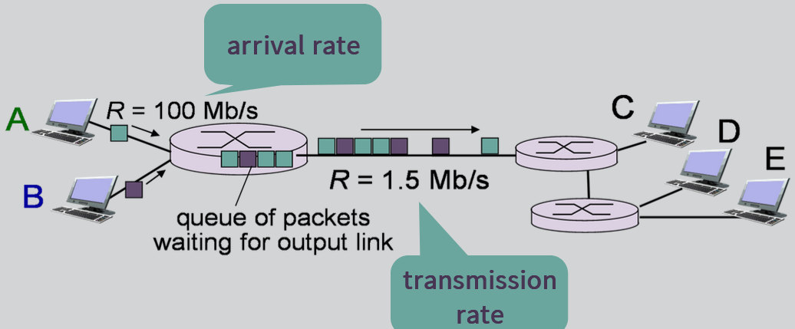

**Two key network-core functions**

1. Routing: determines source-destination route taken by packets
2. Forwarding: move packets from router's input to appropriate router output

**Internet Structure: Network of Networks**

- End systems connect to internet via access ISPs (Internet Service Providers): residential, company and university ISPs
- Access ISPs in turn must be interconnected, so that any two hosts can send packets to each other
- Resulting network of networks is very complex. Evolution driven by economics and national policies
- Using internet-exchange points and peering links (connect to other providers) to connect independent regional ISPs with local ISPs and connect them with each other
- Also use regional ISPs that are smaller than the global providers, but larger than local ISPs
- Also have content provider networks (ex: Google, Microsoft, Akamai) may run their own network to bring services & content closer to end users.

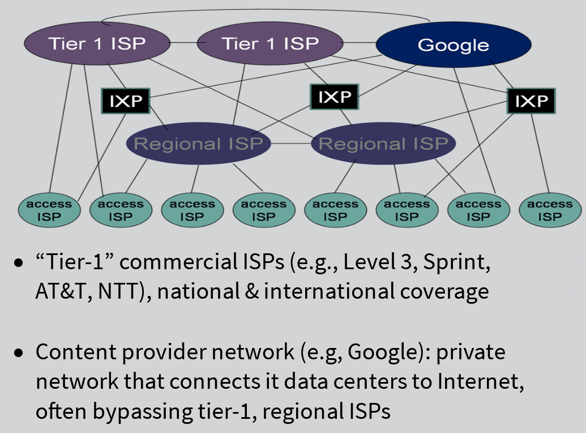

---

How do Loss and Delay Occur?

- Packet arrival rate to link (temporarily) exceeds output link capacity
- Packets queue, wait for turn

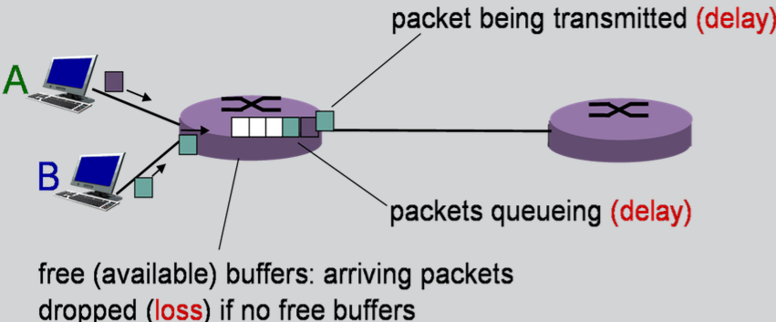

Four sources of packet delay:

1. Drop: nodal processing  
   a. Check bit errors  
   b. Determine output link  
   c. Typically < msec (milliseconds)
2. dqueue : queueing delay  
   a. Time waiting at output link for transmission  
   b. Depends on congestion level of router
3. dtrans: transmission delay  
   a. L: packet length (bits)  
   b. R: link bandwidth (bps)  
   c. dtrans = L/R
4. dprop : propagation delay - length of time it takes packet to move through entire link  
   a. d: length of physical link  
   b. s: propagation speed in medium (~2 x 108 m/sec)  
   c. dprop = d/s

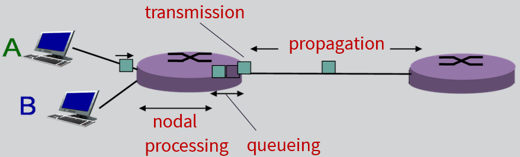
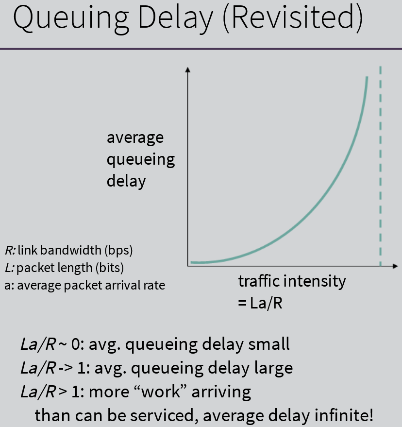

Packet Loss

- Queue (a.k.a buffer) preceding link in buffer has finite capacity
- Packet arriving to full queue dropped (a.k.a loss)
  Throughput
- Rate (bits/time unit) at which bits transferred between sender/receiver
  - Instantaneous: rate (bits/time unit) at which bits transferred between sender/receiver
  - Average: rate over longer period of time

---

Protocol "Layers"

- Complex networks
  - Hosts
  - Routers
  - Applications
  - Protocols
  - Hardware
  - Software
  - Links of various media
- Organized with a layering approach
  - Each layer implements a service
    - Via its own internal-layer actions
    - Relying of services provided by layer below

Why Layering?

- Explicit structure allows identification & relationship of complex system's pieces
  - Layered reference model for discussion
- Modularization eases maintenance, updating of system
  - Change of implementation of layer's service transparent to rest of system
  - Ex: change in gate procedure doesn't affect rest of system

**Internet Protocol Stack**

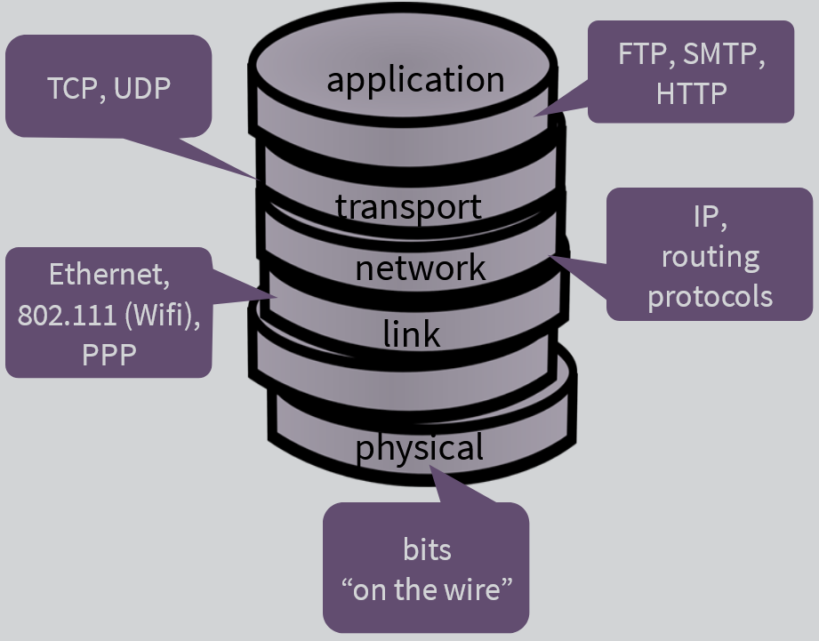

OSI model included the "presentation" (encryption, compression, etc.) and "session" (synchronization, checkpointing etc.) layers - these are included in the application layer of the Internet Protocol Stack

**Encapsulation (how all the layers work)**

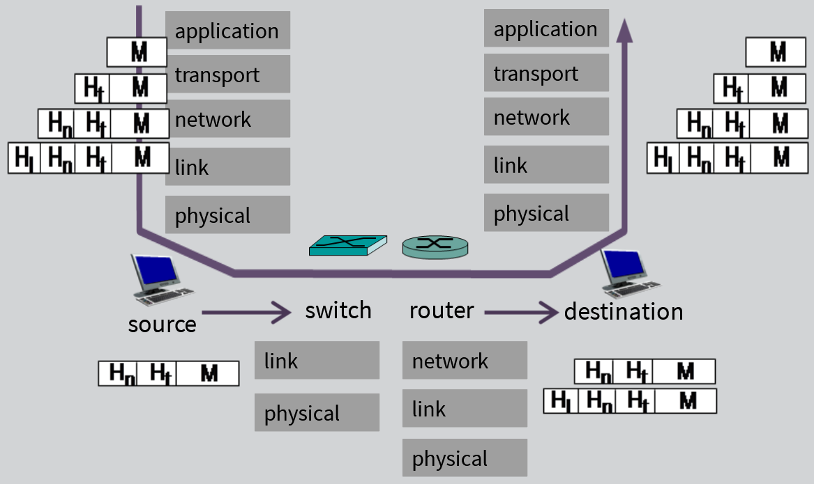

---

**Network Security**

- How computer networks can be attacked
- Defend networks against attacks
- Architectures that are immune to attacks
- Internet not originally designed with (much) security in mind
  - Group of mutually trusting users attached to a transparent network
  - Internet protocol designers playing "catch-up"
  - Security considerations in all layers

Network attackers:

- Malware can get in host from:
  - Virus: self-replicating infection by receiving/executing object (ex: e-mail attachment)
  - Worm: self-replicating infection by passively receiving object that gets itself executed
- Spyware (malware) can record keystrokes, web sites visited, upload info to collection sites
- Infected host can be enrolled in botnet, used for spam --> DDoS (Distributed Denial of Service) attacks
  - Denial of Service (DoS):
    - Attackers make resources (server, bandwidth) unavailable to legitimate traffic by overwhelming resource with bogus traffic

Packets Sniffing & IP Spoofing

- Packet "sniffing"
  - Broadcast media (share ethernet, wireless)
  - Promiscuous network interface reads/records all packets (ex: including passwords) passing by
- IP spoofing
  - Send packet with false source address
