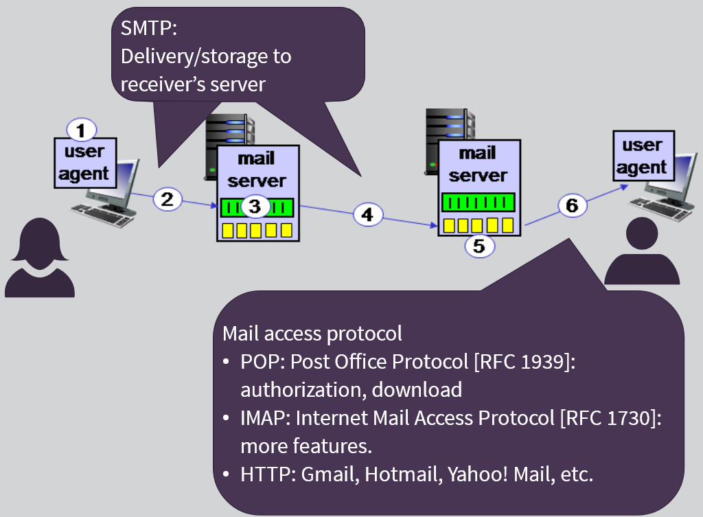

# Week 2: Application Layer

Examples of networking applications:

- E-mail
- Web
- Text messaging
- Remote login
- P2P file sharing
- Multi-user network games
- Streaming stored video (YouTube, Netflix, Hulu etc.)
- Real-time video conferencing
- Social networking
- Search

What is a network app?

- An application that communicates with other applications over the network

Creating a network app

- No need to write software for network-core devices (ex: iPhone, PC, car etc.)
- Network-core devices do not run user applications
- Applications on end systems allows for rapid app development & propagation

Two types of application architectures:

1. Client-server
   a. Server: always on host, permanent IP address, data centers for scaling
   b. Clients: communicate with server, may be intermittently connected, may have dynamic IP addresses, do not communicated directly with each other
2. Peer-to-peer (P2P); ex: file sharing, movie-sharing and other software distribution
   a. No always-on server
   b. Arbitrary end systems directly communicate
   c. Peers request service from other peers, provide service in return to other peers
   d. Complex management: peers are intermittently connected and change IP addresses
   e. Self-scalability - new peers bring new service capacity, as well as new service demands

Processes Communicating:

- Client process: process that initiates communication
- Server process: process that waits to be contacted
- Process:
  - Running within a host
  - Within same host, two processes communicate using inter-process communication (defined by OS)
  - Processes in different hosts communicate by exchanging messages
  - Applications within P2P architectures have client processes & server processes

Sockets:

- Processes send/receive messages to/from sockets
- Sockets are like a door!
  - Sending process sends the message through the (sending) socket, goes through the network, is received through the appropriate door (socket) and is served up to the receiving application.

Addressing Processes:

- To receive messages, process must have identifier
- Host device has unique 32-bit IP address
- Identifier includes both IP address and port numbers associated with process on host
- Example port numbers:
  - HTTP server: 80
  - Mail server: 25
  - To send HTTP message to gaia.cs.umass.edu web server:
    - IP address: 128.119.245.12
    - Port number: 80

App-layer Protocol
Defines:

- Types of messages exchanged:
  ○ Ex: request, response
- Message syntax
  ○ What fields in messages & how fields are delineated
- Message semantics
  ○ Meaning of information in fields
- Rules for when and how processes send & respond to messages

Open Protocols:

- Defined in RFCs (Request For Comments)
- Allows for interoperability
- Ex: HTTP, SMTP
  Proprietary protocols:
- Ex: Skype

Transport Service selection for an App

- Some apps (ex: file transfer, web transactions) require 100% reliable data transfer
- Other apps (ex: audio) can tolerate some loss
- Some apps (ex: internet telephony, interactive games) require low delay to be "effective"
- Some apps (ex: multimedia) require minimum amount of throughput to be "effective"
- Other apps ("elastic apps") make use of whatever throughput they get
- Encryption, data integrity

---

**Internet Transport Protocols Services**

TCP service:

- Reliable transport between sending and receiving process
- Flow control: sender won't overwhelm receiver
- Congestion control: throttle sender when network overloaded
- Does not provide: timing, minimum throughput guarantee, security
- Connection-oriented: setup required between client and server processes

UDP service:

- Unreliable data transfer between sending and receiving process
- Does not provide: reliability, flow control, congestion control, timing, throughput guarantee, security, or connection setup
- Approx.. 40% less bandwidth requirement - good for networks with bandwidth constraints

Web and HTTP

- Objects: HTML file, JPEG image, java applet, audio file...
- Base HTML-file which includes several referenced objects
- Each object is addressable by a URL

**HTTP Overview**

- Hypertext Transfer Protocol - web's application layer protocol
- Follows client-server model
  - Client: browser that requests, receives, and "displays" web objects
  - Server: web server sends objects in response to requests
- HTTP is "stateless"
  - Server maintains no information about past client request
  - Uses TCP:
    - Client initiates TCP connection (creates socket) to server, port 80
    - Server accepts TCP connection from client
    - HTTP messages (application-layer protocol messages) exchanged between browser (HTTP client) and Web server (HTTP server)
    - TCP connection closed
- HTTP Connections;
  - Non-persistent HTTP
    - At most, one object sent over TCP connection; connection then closed
    - Downloading multiple objects required multiple connections
  - Persistent HTTP
    - Multiple objects can be sent over single TCP connection between client, server

- Persistent HTTP:
  - Server leaves connection open after sending response
  - Subsequent HTTP messages between same client/server sent over open connection
  - Client sends requests as soon as it encounters a referenced object
  - As little as on RTT (Round-Trip Time) for all the referenced objects
- Non-persistent HTTP issues:
  - Requires 2 RTTs per object
  - OS overhead for each TCP connection
  - Browsers often open parallel TCP connections to fetch referenced objects
- If network is stable, use Persistent HTTP. If network is choppy, use non-persistent HTTP to transfer large number of smaller object and pull file together

---

- HTTP Response Status codes:
  - Appear in 1st line in server-to-client response message
  - Sample codes:
    - 200 OK: request succeeded, requested object later in this msg
    - 404 not found: request document not found on this server
    - 505 HTTP Version Not Supported
    - 301 Moved Permanently
      - Requested object moved, new location specified later in this msg
    - 400 Bad Request
      - Request msg not understood by server

---

User-server state: Cookies

- Maintain user-information on server-side
  Example:
- Susan always accesses internet from PC
- Visits specific e-commerce site for first time
- When initial HTTP requests arrives at site, site creates:
  - Unique ID
  - Entry in backend database for ID
- Four component:
  1.  Cookie header line of HTTP response message
  2.  Cookie head line in next HTTP request message
  3.  Cookie file kept on user's host, managed by user's browser
  4.  Back-end database at web site

What cookies can be used for:

- Authorization
- Shopping carts
- Recommendations
- User-session state (web mail)
  Cookies and privacy:
- Cookies permit sites to learn a lot about you
- You supply name, e-mail (and more) to sites

Web Caches (Proxy Server)
Goal: satisfy client request without involving origin server

- User sets browser: web accesses via cache
- Browser sends all HTTP requests to cache
  - Object in cache: cache returns object
  - Else cache requests object from origin server, then returns object to client
- Cache is an intermediary that acts as a client and a server
  - Server for original requesting client
  - Client to origin server
  - Typically cache is installed by ISP (university, company, residential ISP)
  - Reduce response time for client request
  - Reduce traffic time on an institution's (internet) access link
  - Poor content providers get better access
  - Installing local web cache/proxy (ex: global companies with a lot of internet content) instead of installing a "fatter" access link (to the internet) is cheaper and access is more efficient.

Conditional GET (HTTP app-layer protocol) - check whether content is up-to-date

- Goal: don't send object if cache has up-to-date cached version
  - No object transmission delay
  - Lower link utilization
- Cache: specify date of cached copy in HTTP request
  - If-modified-since: `<date>`
- Server: response contains no object if cached copy is up-to-date:
  - HTTP/1.0 304 not modified
- Store content for future use

Electronic mail protocols: SMTP (Simple Mail Transfer Protocol), POP3, IMAP

Mail servers contain:

- Incoming messages for user
- Message queue of outgoing (to be sent) mail messages
- Use SMTP between other mail servers to send/receive messages

SMTP (RFC 2821)

- Uses TCP to reliably transfer email message client to server, port 25
- Direct transfer: sending server to receiving server
- Three phases of transfer
  - Handshaking (greeting)
  - Transfer of messages
  - Closure

Mail Access Protocols:

IMAP features:

- Manipulation of stored messages
- Creation of folders
- Etc.

POP3:

- Previous example uses POP3 "download and delete" mode - when storage was very expensive
- Bob cannot re-read e-mail if he changes client
- POP3 "download and keep": copies message on different clients
- POP3 is stateless across sessions - Read messages on one device, show as unread on another
  IMAP:
- Keeps all messages in one place: at server
- Allows user to organize messages in folders
- Keeps user state across sessions:
  - Names of folders and mappings between message Ids and folder name

---

**DNS: Domain Name System**

- People: many identifiers:
  - SSN, name, passport #
- Internet hosts, routers:
  - IP address (32-bit) - used for addressing datagrams
  - "Name", ex: www.yahoo.com - used by humans to map onto IP address
- Domain Name System:
  - Distributed database implemented in hierarchy of many name servers
  - Application-layer protocol: hosts, name servers communicate to resolve names (address/name translation)
    - Note: core internet function, implemented as application-layer protocol
    - Complexity moved to network's "edge"
- DNS Services
  - Hostname to IP address translation
  - Host aliasing
    - Canonical, alias names
  - Mail server aliasing
  - Load distribution
    - Replicated web servers: many IP addresses correspond to one name
  - Why not centralize DNS?
    - Single point of failure
    - Traffic volume
    - Distant centralized database
    - Maintenance
    - Does not scale

Top-level domain (TLD) Servers:

- Responsible for .com, .org, .net, .edu, .aero, .jobs, .museums, and all top-level country domains, ex: .uk, .fr, .ca, .jp
- Network Solutions maintains servers for .com TLD
- Educause for .edu TLD

Authoritative DNS Server(s):

- Organization's own DNS server(s), providing hostname to IP mappings for organization's named hosts
- Can be maintained by organization or service provider (ex: GoDaddy)

Local DNS Name Server:

- Does not strictly belong to hierarchy
- Each ISP (residential ISP, company, university) has one
  - Also called "default name server"
- When host makes DNS query, it is sent to its local DNS server
  - Has local cache of recent name-to-address translation pairs (but may be out of date!)
  - Acts as proxy, forwards query into hierarchy if name not found

Two ways of obtaining domain (and serving to the client):

DNS: Caching, updating records

- Once (any) names server learns mapping, it caches mapping
  - Cache entries timeout (disappear) after some time (TTL)
  - TLD servers typically cached in local name servers
    - Thus root name servers not often visited
  - Cached entries may be out-of-date (best effort name-to-address translation!)
    - If name host changes IP address, may not be known internet-wide until all TTLs expire
  - Update/notify mechanisms proposed IETF standard
    - RFC 2136

Inserting records into DNS

- Example: new startup called "Network Utopia" @ networkutopia.com
- Register name networkutopia.com @ DNS registrar (ex: Network Solutions or GoDaddy)
  - Provide names, IP addresses of authoritative name server (primary and secondary)
  - Registrar inserts two RRs into .com TLD server:
    - (networkutopia.com, dns1.networkutopia.com, NS)
    - (dns1.networkutopia.com, 212.212.212.1, A)
- Create authoritative server type A record for www.networkutopia.com: type MX record for newtorkutopia.com

Attacking DNS

- DDoS attacks
  - Bombard root servers with traffic
    - Not successful to date
    - Traffic filtering
    - Local DNS servers cache IP's of TLD servers, allowing root server bypass
  - Bombard TLD servers
    - Potentially more dangerous
- Redirect attacks
  - Man-in-the-middle
    - Intercept queries - browsers redirected to completely different servers
  - DNS poisoning
    - Send bogus replies to DNS server, which caches
  - Exploit DNS for DDoS
    - Send queries with spoofed source address: target IP
    - Requires amplification

---

**P2P applications**

Pure P2P architecture:

- No always-on server
- Arbitrary end systems directly communicate
- Peers are intermittently connected and change IP addresses

Examples:

- File distribution (BitTorrent)
- Streaming (KanKan)
- VoIP (Skype)

In this model, file distribution occurs sequentially

In this model, files are distributed among the clients without waiting for the file-copy download (the file itself)

BitTorrent also used to distribute software (ex: new releases for developers)

Distributed Hash Table (DHT)

- A distributed P2P database
- Database has (key, value) pairs, examples:
  - Key: social-security number; value: human name
  - Key: movie title; value: IP address
- Distribute the (key, value) pairs over the (millions of) peers
- A peer queries DHT with key
  - DHT returns values that match the key
- Peers can also insert (key, value) pairs
