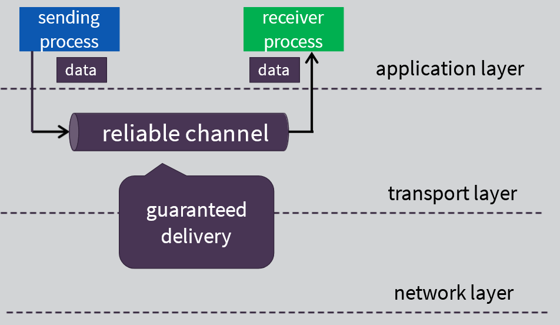
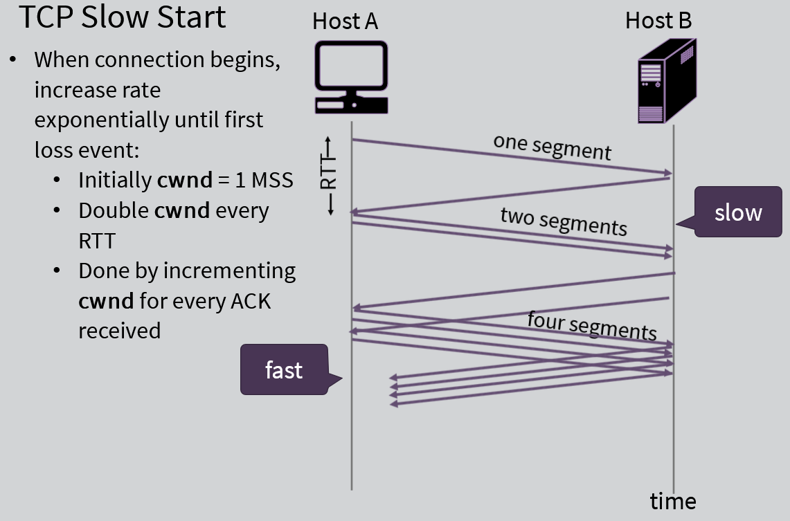

# Week 3: Transport Layer

Transport Services and Protocols

- Provide logical communication between app processes running on different hosts
- Transport protocols run in end systems
  - Send side: breaks app messages into segments, passes to network layer
  - Receive side: reassembles segments into messages, passes to app layer
- More than one transport protocol available to apps
  - Internet: TCP and UDP

**TCP: Transmission Control Protocol**

- Reliable, in-order delivery - Congestion control - Flow control - Connection setup "handshake"
  UDP: User Datagram Protocol
- No-frill extension of "best-effort" IP
  - Really fast
- Services not available:
  - Delay guarantees
  - Bandwidth guarantees

Multiplexing and Demultiplexing

How Demultiplexing Works

Connectionless Demultiplexing (used by DNS protocol)

- When host receives UDP segment:
  - Checks destination port # in segment
  - Directs UDP segment to socket with that port #
- IP datagrams with same destination port #, but different source IP addresses and/or source port numbers will be directed to same socket at destination

Connection-Oriented Demux (Demultiplexing)

- TCP socket identified by 4-tuple:
  1. Source IP address
  2. Source port number
  3. Destination IP address
  4. Destination port number
- Server host may support many simultaneous TCP sockets: each socket identified by its own 4-tuple
- Web servers have different sockets for each connecting client
  - Non-persistent HTTP will have different socket for each request

Example:

Connectionless Transport: UDP

- Connectionless:
  - No handshaking between UDP sender & receiver
  - Each UDP segment handled independently of others
- UDP use:
  - Streaming multimedia apps (less tolerant, rate sensitive)
  - DNS
- "Best effort" service
  - UDP segments may be:
    - Lost
    - Delivered out-of-order to app
- Very fast speeds!

---

Principles of Reliable Data Transfer

- Ensure certain applications have a guaranteed delivery of packets (data)

SMTP, HTTP require reliable channel to move packets from source to destination
Knowing that networks may be unreliable, we have to build mechanisms inside protocols to ensure reliability of delivery

RDT: Getting started

Dependency between the "event" and the "state"

- Define which event caused a transition from one state to the next

RDT 1.0: Reliable transfer over a reliable channel

- Underlying channel perfectly reliable
  - No bit errors
  - No loss of packets
- Separate FSMs for send, receiver:
  - Senders sends data into underlying channel
  - Receiver reads data from underlying channel

RDT 2.0: Channel with Bit Errors

- Underlying channel may flip bits in packet (ex: electromagnetic interference (EMI) or other natural forces)
  - Checksum to detect bit
- The question: how to recover from errors?
  - Acknowledgments (ACKs): receiver explicitly tells sender that packet received OK
  - Negative acknowledgments (NAKs): receiver explicitly tells sender that packet had errors
  - Sender retransmits packet on receipt of NAK
- Has a fatal flaw!
  - What happens if ACK/NAK is corrupted?
    - Sender doesn't know what happened at receiver!
    - Can't just retransmit: possible duplicate
  - Handling duplicates:
    - Sender retransmits current packet if ACK/NAK corrupted
    - Sender adds sequence number to each packet
    - Receiver discards (doesn't deliver up) duplicate packet
  - Stop and wait
    - Sender sends on packet, then wait for receiver response

RDT 2.1: Discussion
Sender:

- Sequence # added to packet
- Two sequence #s (0,1) will suffice - stop and wait operation
- Must check if received ACK/NAK corrupted
- Twice as many states - State must "remember" whether "expected" packet should have sequence # of 0 or 1

  Receiver:

- Must check if received packet is duplicate
  - State indicates whether 0 or 1 is expected packet sequence #
- Note: receive can not know if its last ACK/NAK received OK at sender

RDT 2.2: a NAK-free protocol

- Same functionality as RDT2.1, using ACKs only
- Instead of NAK, receiver sends ACK for last packet received OK
  - Receiver must explicitly include sequence number of packet being ACKed
- Duplicate ACK at sender results in same action as NAK: retransmit current packet

RDT 3.0: Channels with Errors and Loss  
New assumption:

- Underlying channel can also lose packets (data, ACKs) - Checksum, sequence #, ACKs, retransmissions will be of help...but not enough

  Approach:

- Sender waits "reasonable" amount of time for ACK
- Retransmits if no ACK received in this time

- If packet (or ACK) just delayed (not lost):
  - Retransmission will be duplicate, but sequence #s already handles this
  - Receiver must specify sequence # of packet being ACKed
- Requires countdown timer

Performance of RDT 3.0

- RDT 3.0 is correct, but performance is poor
- Ex: 1 Gbps link, 15 ms propagation delay, 8000 bit packet:
  - Dtrans = L/R = (8000 bits)/(10^9 bits/sec)=8 μs
  - Usender: utilization - fraction of time sender busy
  - Usender = (L/R)/(RTT+L/R)=0.008/30.008=0.00027
  - If RTT = 30 millisecond, 1KB packet every 30 millisecond: 33kB/second throughput over 1Gbps link

---

Improving RDT protocols performance:  
Introduce "pipelining"

- Sender going to allow multiple "in-flight", but yet-to-be-acknowledged packets in the transmission
  - As if we are "stuffing" the line with information without waiting for each packet's acknowledgment
- Two generic forms:
  - Go-Back-N
  - Selective N

Pipelined Protocols: Overview

Go-back-N:

- Sender can have up to N unacked packets in pipeline
- Receiver only sends cumulative ack
  - Doesn't ack packet if there's a gap
- Sender has timer for oldest unacked packet
  - When timer expires, retransmit all unacked packets

Selective Repeat:

- Sender can have up to N unacked packets in pipeline
- Receiver sends individual ack for each packet
- Sender maintains time for each unacked packet
  - When timer expires, retransmit only that unacked packet

Selective Repeat

- Receiver individually acknowledges all correctly received packets
  - Buffers packets as needed, for eventual in-order delivery to upper layer
- Sender only resends packets for which ACK not received
  - Sender timer for each unacked packet
- Sender window
  - N-consecutive sequence numbers
  - Limits sequence numbers of sent, unacked packets

TCP Overview:

RFCs: 793, 1122, 1323, 2018, 2581

- Point-to-point:
  - One sender, one receiver
- Reliable, in-order byte stream:
  - No "message boundaries"
  - Packets sent/received (by application layer) in same order
- Pipelined:
  - TCP congestion and flow control sets window size
- Full duplex data:
  - Bi-directional data flow in same connection
  - MSS: maximum segment size
- Connection-oriented:
  - Handshaking (exchange of control messages), inits sender, receiver state before data exchange
- Flow-controlled:
  - Sender will not overwhelm receiver

TCP sequence numbers & acknowledgment numbers

Sequence:

- Byte stream "number" of first byte in segment's data

Acknowledgment:

- Sequence # of next byte expected from other side
- Cumulative ACK

TCP Round Trip Time, Timeout

Q: How to set TCP timeout value?

- Longer than RTT - but RTT varies
- Too short: premature timeout, unnecessary transmissions
- Too long: slow reaction to segment loss

Q: how to estimate RTT?

- Sample RTT: measured time from segment transmission until ACK receipt
  - Ignore retransmissions
- Sample RTT will vary, want estimated RTT "smoother"
  - Average several recent measurements, not just current Sample RTT

TCP: Retransmission Scenarios

TCP ACK Generation feature (RFC 1122, RFC 2581)

TCP Fast Retransmit (TCP feature)
If sender receives 3 ACKs for same data ("triple duplicate ACKs"), resend unacked segment with smallest sequence #

- Likely that unacked segment lost, so don't wait for timeout

TCP Flow Control:

Receiver controls sender, so sender won't overflow receiver's buffer space by transmitting too much, too fast

rwnd = receiver window

Agreeing to Establish a Connection

TCP 3-way handshake

TCP: Closing a connection (FINbit = Final Bit)

Principles of Congestion Control
Congestion:

- Informally: "too many sources sending too much data too fast for network to handle"
- Different from flow control
- Manifestations:
  - Lost packets (buffer overflow at routers)
  - Long delays (queueing in router buffers)
- Another "cost" of congestion:
  - When packet dropped, any "upstream" transmission capacity user for that packet was wasted.
    - The line will sit idle and unused

TCP Congestion Control

1. Additive Increase Multiplicative Decrease (AIMD)
   - Approach: sender increases transmission rate (window size), probing for usable bandwidth, until loss occurs

2. TCP Slow Start
   
