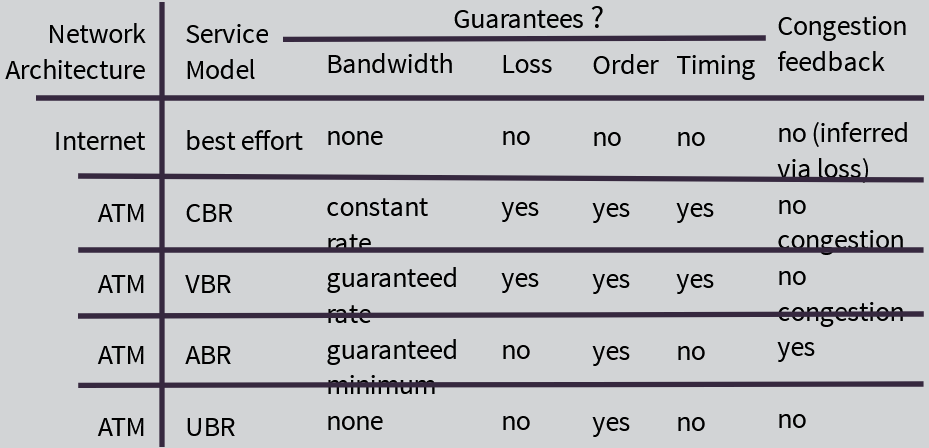

# Week 4: Network Layer

Network Layer:

- Transport segment from sending to receiving host
- On sending side: encapsulates segments (from upper OSI-model layers) into datagrams
- On receiving side: delivers segments to transport layer (lower layer in OSI-model)
- Router examines header fields in all IP datagrams passing through it
- Network layer exists in every single device on a network

Key Network Layer Functions:

1. Forwarding: move packets from router's input to appropriate router output
2. Routing: determine route taken by packets from source to destination

Analogy:

- Routing: process of planning trip from source to destination
- Forwarding: process of getting through single interchange

---

Network Service Model

Q: What service model for "channel" transporting datagrams from sender to receiver?

Example services for individual datagrams:

- Guaranteed delivery
- Guaranteed delivery with less than 40 msec delay

Examples for a flow of datagrams:

- In-order datagram delivery
- Guaranteed minimum bandwidth to flow
- Restrictions on changes in inter-packet spacing

Virtual Circuit & Datagrams Networks

- Datagram network provides network-layer connectionless service
- Virtual-circuit network provides network-layer connection service
- Analogous to TCP/UDP connection-oriented/connectionless transport-layer services, but:
  - Service: host-to-host
  - No choice: network provides one or the other
  - Implementation: in network core

Virtual Circuits:

- source-to-destination path behaves much like telephone circuit:
  - Performance-wise
  - Network actions along source-to-destination path
- Call setup, teardown for each call before data can flow
- Each packet carries VC identifier (not destination host address)
- Every router on source-dest path maintains "state" for each passing connection
- Link, router resources (bandwidth, buffers) may be allocated to VC (dedicated resources = predictable service)

Datagram or VC Network: Why?
Internet (datagram)

- Relatively inexpensive implementation
- Data exchange among computers
  - "elastic" service, no strict timing requirements
    - In a congested network, routers will re-send packets/re-route the path
- Many link types (ex: fibre, copper)
  - Different characteristics
  - Uniform service difficult
- "Smart" end systems (computers)
  - Can adapt, perform control, error recovery
  - Simple inside network, complexity at "edge"

ATM (VC) - Asynchronous Transfer Model

- Evolved from telephony
- Human conversation:
  - Strict timing, reliability requirements
  - Need for guaranteed service
- "Dumb" end systems
  - Telephones
  - Complexity inside network
- Frequently used in banking &telecom networks

---

Router Architecture Overview

Input Port Functions

Switching Fabrics (combination of hardware and software)

- Transfer packets from input buffer to appropriate output buffer
- Facilitate very fast transmission of the packets from input ports - avoid HOL blocking from input ports
- Switching rate: rate at which packets can be transferred from inputs to outputs
  - Often measured as multiple of input/output line rate
  - N inputs: switching rate N times line rate desirable
- Three types of switching fabrics
  - Memory
  - Bus
  - Crossbar

Output Ports

IP: Internet Protocol

IP Fragmentation, Reassembly
Having different links and different routers, fragmentation & reassembly is used when:
Large IP datagram divided ("fragmented") within network (ex: high bandwidth router with low bandwidth link)

- One datagram becomes several datagrams
- "reassembled" only at final destination and pushed to upper layers (TCP/UDP)
- IP header bits used to identify, order related fragments

`fragflag`:  
whether or not there are other packets behind the one just processed
offset: how many bits we have to go through (packet-level) where the next fragment starts

IP Addressing

- IP address: 32-bit identifier for host, router interface
- Interface: connection between host/router and physical link
  - Router's typically have multiple interfaces
  - Host typically has one or two interfaces (ex: wired ethernet, wireless 802.11)
- IP addresses associated with each interface

Subnets

- Device interfaces with same subnet part of IP address
- Can physically reach each other without intervening router
  - Devices on different subnets require router intervention
- IP address:
  - Subnet part - high order bits
  - Host part - low order bits

IP Addressing: CIDR (RFC 1918)
CIDR = Classless InterDomain Routing

- Subnet portion of address of arbitrary length
- Address format: a.b.c.d./x, where x is number of bits in subnet portion of address

Q: How does a host get IP address?

- Hard-coded by system admin in a file
  - Windows: control-panel --> network-configuration --> TCP/IP --> properties
  - UNIX: /etc/rc.config
- DHCP: Dynamic Host Configuration Protocol: dynamically get address from a server - "plug-and-play"
- In residential networks, DHCP is typically built-into a router
  - For school, businesses etc. It is usually in a standalone computer
- DHCP can return more than just allocated IP address on subnet:
  - Address of first-hop router for client
  - Name and IP address of DNS server
  - Network mask (indicating network versus host portion of address)

Q: How does network get subnet part of IP address?  
A: gets allocated portion of its provider ISP's address space

Q: How does an ISP get block of addresses?  
A: ICANN: Internet Corporation for Assigned Names and Numbers

- Allocates addresses
- Manages DNS
- Assigns Domain Names, resolves disputes

NAT: Network Address Translation

- Not enough IP addresses
- Classes of private internet addresses

These blocks are not routable on the internet.

NAT translates/maps internal/private IP addresses to an external/public & routable address to the internet

Motivation for NAT: Local network uses just one IP address as far as outside world is concerned:

- Range of address not needed from ISP: just one IP address for all devices
- Can change addresses of devices in local network without notifying outside world
- Can change ISP without changing addresses of devices in local network
- Devices inside local network not explicitly addressable/visible by outside world - more secure

---

**Routing Algorithms**

Graph Abstraction

Construct network using different algorithms help us develop the least-cost path utilizing information provided by routers and by assigned links

Routing Algorithm Classification

Global or Decentralized information?

Global:

- All routers have complete topology, link cost info
- "Link state" algorithms

Decentralized:

- Router knows physically-connected neighbors, link costs to neighbors
- Iterative process of computation, exchange of info with neighbors
- "Distance vector" algorithms

Static or Dynamic?

Static:

- Routes change slowly over time
- Routes are assigned and maintained

Dynamic:

- Routes change more quickly
  - Periodic update
  - In response to link cost changes

For smaller networks (home, small office), static & decentralized algorithms are used. For large/corporate networks, dynamic & global algorithms are used.

Link State Algorithm:

Distance Vector Algorithm:

- Least-cost result of the sum of the routes

Comparison of LS (Link State) and DV (Distance Vector) Algorithms:

Message complexity:

- LS: with n nodes, large number of message sent. Messages sent throughout entire network
- DV: exchange between neighbors only
  - Convergence time varies

What happens if route malfunctions?
LS:

- Node can advertise incorrect link cost
  - May result in delayed packet delivery
- Each node computes only its own table
  DV:
- DV node can advertise incorrect path cost
  - May result in non-delivery of the packet
- Each node's table used by others error propagate through network

Speed of convergence

- LS: may have oscillations
- DV: convergence time varies
  - May be routing loops
  - Count-to-infinity problem

---

Hierarchical Routing

- Our routing study thus far - idealization
- All routers identical
- Network "flat"
  …not true in practce

Scale: with 600 million destinations:

- Can't store all dest's in routing tables!
- Routing table exchange would swamp links!

Administrative autonomy:

- Internet = network of networks
- Each network admin may to control in its own network

Aggregate routers into regions, "autonomous systems" (AS)

Routers in same AS run same routing protocol

- "intra-AS" routing protocol
- Routers in different AS can run different intra-AS routing protocol

Gateway router:

- Routers in different AS can run different intra-AS routing protocol
- Has link to router in another AS

Routing in the internet:
Intra-AS routing

- A.k.a interior gateway protocols (IGP)
- Most common intra-AS routing protocols:
  - RIP: Routing Information Protocol
    - Older distance-vector protocol, used in smaller networks
  - OSPF: Open Shortest Path First
    - Develops open shortest path first and alternatives
  - IGRP: Interior Gateway Routing Protocol (Cisco proprietary)
    - Typically used in private custom-built networks

Policy-based routing protocol, instead of least-cost path routing algorithms. Can move traffic/content exactly where it needs to go! Examples: routing voice, routing video.

Why different routing? Inter-AS vs. Intra-AS (and the respective technologies)

Broadcast routing:

- Deliver packets from source to all other nodes
- Source duplication is inefficient:

