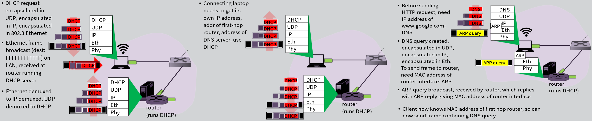

# Week 5: Link Layer

Terminology:

- Hosts and routers: nodes
- Communication channels that connect adjacent nodes along communication path: links
  - Wired links
  - Wireless links
  - LANs
- Layer-2 packet: frame, encapsulates datagram
- Data-link layer has responsibility of transferring datagram from one node to physically adjacent node over a link
- Example (travel from New York to Lausanne, Switzerland):
  - Tourist = datagram
  - Transport segment = communication link
  - Transportation mode = link layer protocol
  - Travel agent = routing algorithm

Link Layer Services

- Framing & link access:
  - Encapsulate datagram into frame, adding head, trailer
  - Channel access if share medium
  - "MAC" addresses used in framer headers to identify source & destination
    - Different from IP address!
  - Reliable delivery between adjacent nodes
    - We learned how to do this already (chapter 3!) - ex: TCP
    - Seldom used on low bit-error link (fiber, some twisted pair)
    - Wireless links: high error rates
- Flow control:
  - Pacing between adjacent sending and receiving nodes
- Error detection:
  - Errors caused by signal attenuation, noise.
  - Receiver detects presence of errors:
    - Signals sender for retransmission or drops frame
  - Error correction:
    - Receiver identifies and corrects bit error(s) without resorting to retransmission
  - Half-duplex and full-duplex
    - With half-duplex, nodes at both ends of link can transmit, but not at the same time

Link Layer Location

- Exists in each and every host
- Link layer implemented in "adaptor" (a.k.a network interface card - NIC) or on a chip
  - Ethernet card, 802.11 card; ethernet chipset
  - Implements link, physical layer
- Attaches into host's system buses
- Combination of hardware, software & firmware

Multiple Access Protocols

- Single share broadcast channel
- Two or more simultaneous transmissions by nodes: interference
  - Collision if node receives two or more signals at the same time
- Multiple access protocol
  - Distributed algorithm that determines how nodes share channel, i.e., determine when node can transmit
  - Communication about channel sharing must use channel itself!
    - No out-of-band channel for coordination

Channel Partitioning MAC protocols:

---

Random Access Protocols

- When node has packet to send
  - Transmit at full channel data rate R
  - No a priori coordination among nodes
- Examples of random access MAC protocols:
  - Slotted ALOHA
  - ALOHA
  - CSMA, CSMA/CD, CSMA/CA

---

Carrier Sense Multiple Access  
CSMA: listen before transmit
If channel sensed idle: transmit entire frame

- If channel sensed busy, defer transmission
- Human analogy: don't interrupt others!

Collisions can still occur: propagation delay means two nodes may not hear each other's transmission

Collision: entire packet transmission time wasted

- Distance & propagation delay play role in determining collision probability

CSMA Collision Detection  
CSMA/CD: carrier sensing, deferral as in CSMA

- Collisions detected within short time
- Colliding transmissions aborted, reducing channel wastage
  Collision detection:
- Easy in wired LANs: measure signal strengths, compare transmitted, received signals
- Difficult in wireless LANs: received signal strength overwhelmed by local transmission strength

Human analogy: the polite conversationalist

"Taking Turns" MAC Protocols
Channel partitioning MAC protocols:

- Share channel efficiently and fairly at high load
- Inefficient at low load: delay in channel access, 1/N bandwidth allocated even if only 1 active node!

Random access MAC protocols

- Efficient at low load: single node can fully utilize channel
- High load: collision overhead
  "Taking turns" protocols look for best of both worlds!

1. Polling

- Main node "invites" dumb nodes to transmit in turn
- Typically used with "dumb" devices
- Concerns:
  - Polling overhead
  - Latency
  - Single point of failure (main node)

2. Token passing:
   - Control token passed from one node to next sequentially
   - Token message
   - Concerns:
     - Token overhead
     - Latency
     - Single point of failure (control token)

---

DOCSIS: data over cable service interface spec

- FDM over upstream, downstream frequency channels
- TDM upstream: some slot assigned, some have contention
  - Downstream MAP frame: assigns upstream slots
  - Request for upstream slots (and data) transmitted random access (binary backoff) in selected slots

---

MAC Addresses and ARP

- 32-bit IP address:
  - Network-layer address for interface
  - Used for layer 3 (network layer) forwarding
- MAC (or LAN or physical of Ethernet) address:
  - Function: used 'locally' to get frame from one interface to another physically-connected interface (same network, in IP-addressing sense)
  - 48-bit MAC address (for most LANs) burned in NIC read-only memory (ROM), also sometimes software-settable

LAN Addresses:

- MAC address allocation administered by IEEE
- Manufacturer buys portion of MAC address space (to assure uniqueness)
- Analogy:
  - MAC address: like social security number
  - IP address: like postal address
- MAC flat address --> portability
  - Can move LAN car from one LAN to another
- IP hierarchical address not portable
  - Address depends on IP subnet to which node is attached

ARP - Address Resolution Protocol

- A wants to send datagram to B
  - B's MAC address not in A's ARP table
- A broadcasts ARP query packet, containing B's IP address
  - Destination MAC address = FF-FF-FF-FF-FF-FF
  - All nodes on LAN receive ARP query
- B receives ARP packet, replies to A with its (B's) MAC address
  - Frame sent to A's MAC address (unicast)
- A caches (saves) IP-to-MAC address pair in its ARP table until information becomes old (times out)
  - Soft state: information that times out (goes away) unless refreshed
- ARP is "plug-and-play":
  - Nodes create their ARP tables without intervention from net administrator

---

Ethernet
"Dominant" wired LAN technology:

- Cheap $20 for NIC
- First widely used LAN technology
- Simpler, cheaper than token LANs and ATM
- Kept up with speed race: 10Mbps-10Gbps

Physical Topology

Multiple Simultaneous Transmissions

- Hosts have dedicated, direct connection to switch
- Switches buffer packets
- Ethernet protocol used on each incoming link, but no collisions; full duplex
  - Each link is its own collision domain
- Switching: A-to-A' and B-to-B' can transmit simultaneously, without collisions
- Switch learns which hosts can be reached through which interfaces
  - When frame received, switch "learns" location of sender: incoming LAN segment
  - Records sender/location pair in switch table

Interconnecting Switches

- Switches can be connected together

---

Virtual LANs (VLANs)
Virtual Local Area Network

Switch(es) supporting VLAN capabilities can be configured to define multiple virtual LANs over single physical LAN infrastructure

---

Multiprotocol Label Switching (MPLS)

MPLS-capable routers - a.k.a label-switched router

- Forward packets to outgoing interface based only on label value (don't inspect IP address)
  - MPLS forwarding table distinct from IP forwarding tables
- Flexibility: MPLS forwarding decisions can differ from those of IP
  - Use destination and source addresses to route flows to same destination differently (traffic engineering)
  - Re-route flows quickly if link fails: pre-computed backup paths (useful for VoIP)

---

Data Center Networks

- 10's to 100's of thousands of hosts, often coupled, in close proximity:
  - E-business (ex: Amazon)
  - Content-servers (ex: YouTube, Akamai, Apple, Microsoft)
  - Search engines, data mining (ex: Google)
- Challenges:
  - Multiple applications, each serving massive numbers of clients
  - Managing/balancing load, avoiding processing, networking, data bottlenecks
- Load balancer: application-layer routing
  - Receives external client requests
  - Direct workload within data center
  - Returns results to external client (hiding data center internals from client)
- Rich interconnection among switches, racks:
  - Increased throughput between racks (multiple routing paths possible)
  - Increase reliability via redundancy

---

---
