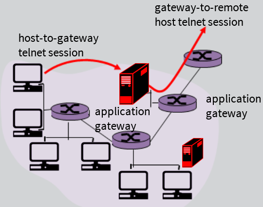

# Week 6: Overview of Network Security

What is Network Security?

1. Confidentiality: only sender, intended receiver should "understand" message contents
   - Sender encrypts message
   - Receiver decrypts message
2. Authentication: sender, receiver must confirm identity of each other
3. Message integrity: sender, receiver want to ensure message not altered (in transit, or afterwards) without detection
4. Access and availability: services must be accessible and available to users

Real-life Bob and Alice

- Web browser/server for electronic transactions (ex: online purchases)
- DNS servers
- Routers exchanging routing table updates

---

Breaking an encryption scheme:

1. Cipher-text only attack: Trudy has ciphertext she can analyze
   - Brute-force: search through all keys
   - Statistical analysis
2. Known-Plaintext attack: Trudy has plaintext corresponding to ciphertext
   - Ex: in monoalphabetic cipher, Trudy determines pairings for a,l,i,c,e,b,o
3. Chosen-plaintext attack: Trudy can get ciphertext for chosen plaintext

Symmetric Key Cryptography

- Bob and Alice share same symmetric key: K (ex: key is knowing substitution pattern in mono alphabetic substitution cipher)
- Challenge arises as devices need to initiate communication and prevent malicious actors from accessing encryption keys

---

Certification Authorities - trusted commercial corporations/companies

- Certification authority (CA): binds public key to particular entity, E
- E (person, router) registers its public key with CA
  - E provides "Proof of Identity" to CA
  - CA creates certificate binding E to its public key
  - Certificate containing E's public key digitally signed by CA - CA says "this is E's public key"

---

Network-Layer Confidentiality
Between two network entities:

- Sending entity encrypts datagram payload; payload could be:
  - TCP or UDP segment, ICMP message, OSPF message
- All data sent from one entity to other would be hidden:
  - Web pages, e-mail, P2P file transfers, TCP SYN packets
- "Blanket Coverage"

- VPN: institution's inter-office traffic is sent over public internet instead
  - Encrypted before entering public internet
  - Logically separate from other traffic
  - Motivations:
    - Institutions often want private networks for security
    - Costly: separate routers, links, private infrastructure

---

IPsec Services (used for network-layer integrity & encryption):

- Data integrity
- Origin authentication
- Reply attack prevention
- Confidentiality

Two IPsec protocols:

- Authentication header (AH) protocol
  - Provides source authentication & data integrity but not confidentiality
- Encapsulation security protocol (ESP)
  - Provides source authentication, data integrity, and confidentiality
  - More widely used than AH

Four combinations:

- Host mode with AH
- Host mode with ESP
- Tunnel mode with AH
- Tunnel mode with ESP (most common and most important)

---

**Firewalls**

Firewall isolates organization's internal network from larger internet, allowing some packets to pass, blocking others

Stateless Packet Filtering:

- Internal network connected to internet via router firewall
- Router filters packet-by-packet, decision to forward/drop packet based on:
  - Source IP address, destination IP address
  - TCP/UDP source and destination port numbers
  - ICMP message type
  - TCP SYN and ACK bits

Stateful packet filtering:

- Stateful Packet Filter:

  - Track status of every TCP connection
    - Track connection setup (SYN), teardown (FIN): determine whether incoming, outgoing packets "make sense"
    - Timeout inactive connection at firewall: no longer admit packets

- Stateless Packet Filter: heavy-handed tool
  - Admits packets that "make no sense" ex: destination port = 80, ACK bit set, even though no TCP connection established

---

Application Gateways (or Proxies):

- Filter packets on application data as well as on IP/TCP/UDP fields
- Example (Telnet):
  - Require all telnet user to telnet through gateway
  - For authorized users, gateway sets up telnet connection to destination host, Gateway relays data between 2 connections
  - Route filter blocks all telnet connections not originating from gateway

Limitation of firewalls, gateways:

- IP spoofing: router can't know if data "really" comes from claimed source
- If multiple apps need special treatment, each has own app gateway
- Client software must know how to contact gateway.
  - Ex: must set IP address of proxy in Web browser
- Filters often use all or nothing policy for UDP
- Trade-off: degree of communication with outside world, level of security
- Many highly protected sites still suffer from attacks

Intrusion Detection Systems ("honeypots" or "listeners")

- Verify that network traffic, passing through routers/servers is legitimate
- Alert firewalls if there is malicious traffic
- Serve as honey-pots that attract attackers and be able to identify the attackers IP address

---
